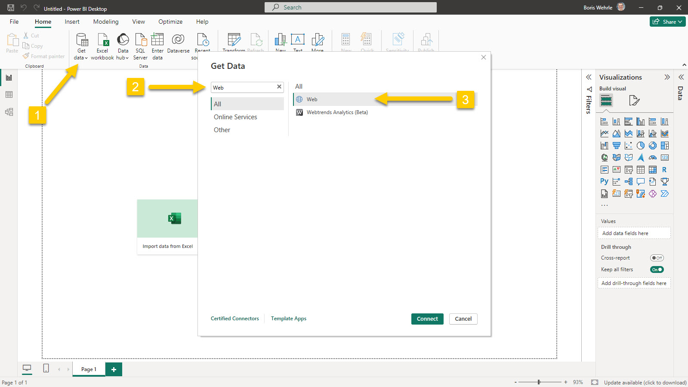
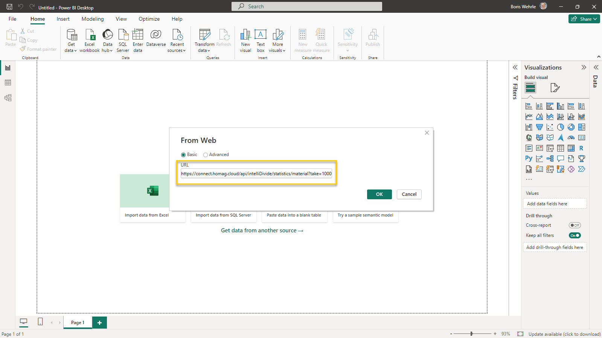
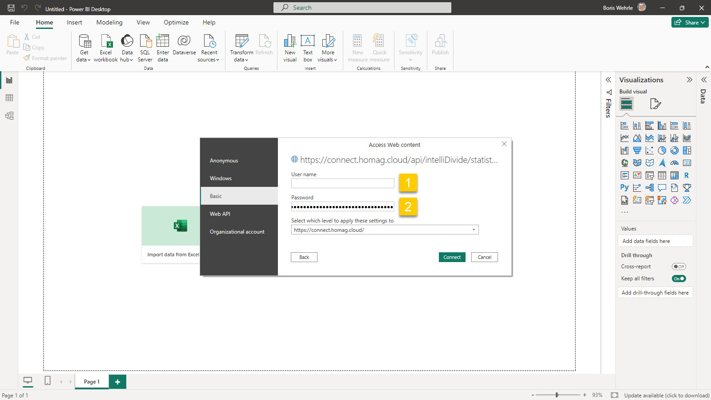
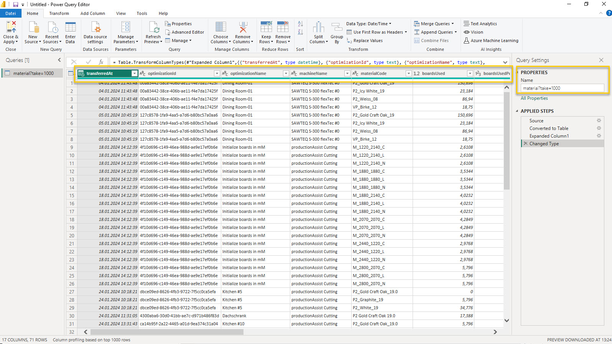
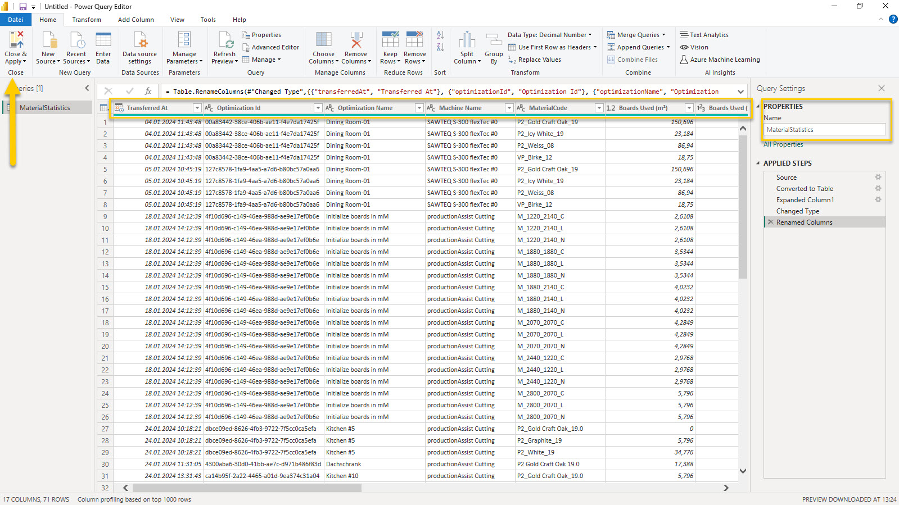
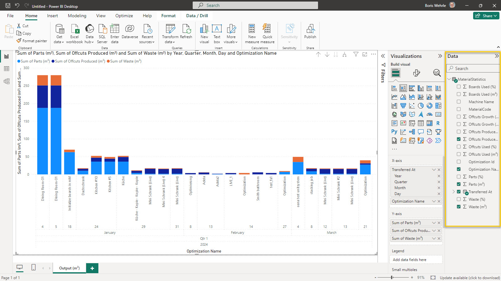

# Anaylze intelliDivide Material Statistics data using Power BI

Microsoft [Power BI](https://www.microsoft.com/en-us/power-platform/products/power-bi) is a powerful tool for analyzing and visualizing data. 

It is available both as a free version and a paid version with advanced features, and can be downloaded from https://powerbi.microsoft.com/en-us/downloads/. 

<strong>To analyze the data the following steps are necessary:</strong>

Define a new data source: In Power BI, go to the Home tab and select "Get Data". Then, select "Web" from the list of available data sources.

 Enter the URL for the Material Statistics API, as described on the [Material Statistics page](MaterialStatistics.md) (e.g. https://connect.homag.cloud/api/intelliDivide/statistics/material?take=1000). 

Enter Subscription Id (1) and Authentication Key (2): You can find the Subscription Id and Authentication Key on the [Authorization](../../Authorization/Authorization.md) page. Copy and paste these values into the appropriate fields in the Power BI Web Connector.

Rename table and columns: After Power BI has generated the table from the API data, it is recommended to rename the table and columns to make them easier to use in reports. You can do this by selecting the table and columns in the Fields pane, and then selecting the "Rename" option.

Close Query Editor: Once you have made any necessary changes to the table and columns, you can close the Query Editor and return to the Power BI report.

Generate charts: Power BI can now be used to generate comprehensive charts and visualizations based on the material statistics data. To create a chart, simply select the relevant fields in the Fields pane, and then drag and drop them onto the canvas. You can also use the Visualizations pane to customize the appearance of your chart.

Some sample reports can be found at [intelliDivide - Material statistics sample reports](../../../Samples/Statistics/Material).