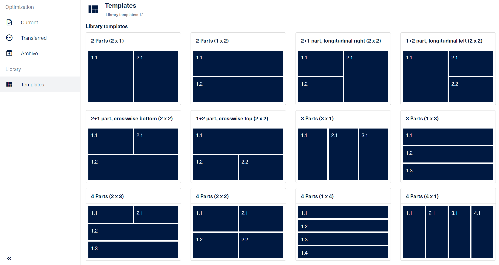

# Cutting optimization request using the object model

As for all optimization requests, you can specify the optimization name, the machine, and the parameters to be used.

```c#
request.Name = "Sample";
request.Machine = "productionAssist Cutting";
request.Parameters = "Default";
```

## Adding parts to the request

The object model allows you to specify the parts to be optimized. 

The sample below shows how to add a part to the request having the required properties set.

``` c#
request.Parts.Add(
    new()
    {
        Description = "Part (required properties)",
        MaterialCode = "P2_White_19",
        Length = 300,
        Width = 300,
        Quantity = 5
    });
```

> For a detailed example, please refer to <i>CuttingRequest_ObjectModel_RequiredProperties_ImportOnly</i> in the file [CuttingRequestUsingObjectModelSamples.cs](CuttingRequestUsingObjectModelSamples.cs).

All other properties which are available in the app can be set as well.

``` c#
request.Parts.Add(
    new()
    {
        Id = "productionRack 1004",
        CustomerName = "HOMAG",
        OrderName = "Kitchen 123",
        OrderDate = DateTime.Today,
        OrderItem = "1.1",

        Notes = "This part shows how to set all properties.",

        Description = "Side panel right",
        MaterialCode = "P2_Gold_Craft_Oak_19.0",
        Grain = Grain.Lengthwise,
        Length = 400,
        Width = 200,

        Quantity = 1,
        QuantityPlus = 5,

        EdgeDiagram = "011:011:000:000",
        EdgeFront = "PP_White_1.3_22_HM",
        EdgeBack = "PP_White_1.3_22_HM",
        EdgeLeft = "PP_White_1.3_22_HM",
        EdgeRight = "PP_White_1.3_22_HM",

        LaminateTop = "HPL_U961_2_0.8",
        LaminateBottom = "HPL_U961_2_0.8",

        FinishLength = 400,
        FinishWidth = 200,

        SecondCutLength = 399,
        SecondCutWidth = 199,

        CncProgramName1 = "SortingS1004",
        CncProgramName2 = "SortingS1004_2",

        LabelLayout = "Label#1",

        Lot = "Lot #1",

        AdditionalProperties = new Dictionary<string, object> { { "DeliveryRegion", "North" } }
    });
```

> For a detailed example, please refer to <i>CuttingRequest_ObjectModel_AdditionalProperties_Optimize</i> in the file [CuttingRequestUsingObjectModelSamples.cs](CuttingRequestUsingObjectModelSamples.cs).

A position in a grain matching template can get referenced as specific formatted string or using a grain matching template object.

``` c#
request.Parts.Add(
    new()
    {
        Description = "Part A",
        MaterialCode = "OAK_19.0",
        Length = 800,
        Width = 600,
        Grain = Grain.Lengthwise,
        Quantity = 1,
        Template = "2 Parts (2 x 1):1.1:1:1" // Position defined like in the app
    });
});

request.Parts.Add(
    new()
    {
        Description = "Part B",
        MaterialCode = "OAK_19.0",
        Length = 800,
        Width = 600,
        Grain = Grain.Lengthwise,
        Quantity = 1,
        Template = new GrainMatchTemplateReference // Position defined in as structured object
        {
            Template = "2 Parts (2 x 1)",
            Positions = new[]
            {
                new GrainMatchTemplatePosition
                {
                    Column = 2,
                    Row = 1
                }
            },
            Trims = GrainMatchingTemplateOptionsTrims.AllSides,
            Dividing = GrainMatchingTemplateOptionsDividing.SeparatePattern,
            Grain = Grain.Lengthwise,
            Instance = 1
        }                   
    });
```

> For a detailed example, please refer to <i>CuttingRequest_ObjectModel_GrainMatchingTemplate_ImportOnly</i> in the file [CuttingRequestUsingObjectModelSamples.cs](CuttingRequestUsingObjectModelSamples.cs).

### Grain matching templates  
The grain match templates are used to ensure that the grain pattern of wood pieces aligns seamlessly across multiple parts. This technique is particularly useful for creating a visually cohesive look in items like cabinet doors, tabletops, or any project where the wood grain continuity is important.

Here’s a brief overview of how it works:

1. Pattern Definition: A template pattern is defined, specifying how the grain should match across the parts. This can include the arrangement and orientation of the grain.
2. Part Assignment: Each part that needs to match the grain is assigned a position within the template. This ensures that when the parts are cut, they maintain the desired grain alignment.
3. Cutting and Optimization: The parts are then cut according to the template, ensuring that the grain matches as specified.

The grain match template currently has 12 default templates and their names are localized with the language set into Tapio account for a particular subscription. The currently 12 ava templates are visible in the image  below.

The syntax used to describe a grain matching template is as follows: 
-	The name delimiter is “:” 
-	In (a x b) – “a” is the number of columns and “b” is the number of rows
  
For example a value like:  “2 Parts (2 x 1):1.1:1:0” means
-	“2 Parts (2x1)” is the name of the grain match template (2 columns, 1 row) 
-	“:” is the delimiter 
-	“1.1” is the position in the template 
-	1  is the instance of the template 
-	0 is the template grain ( where 0 = None (no grain) , 1= Lengthwise grain , 2 = Cross grain)
  
All the positions in a template instance need to have the same grain. 

The 12 currently available templates can be viewed in the image  below.
   
                            
