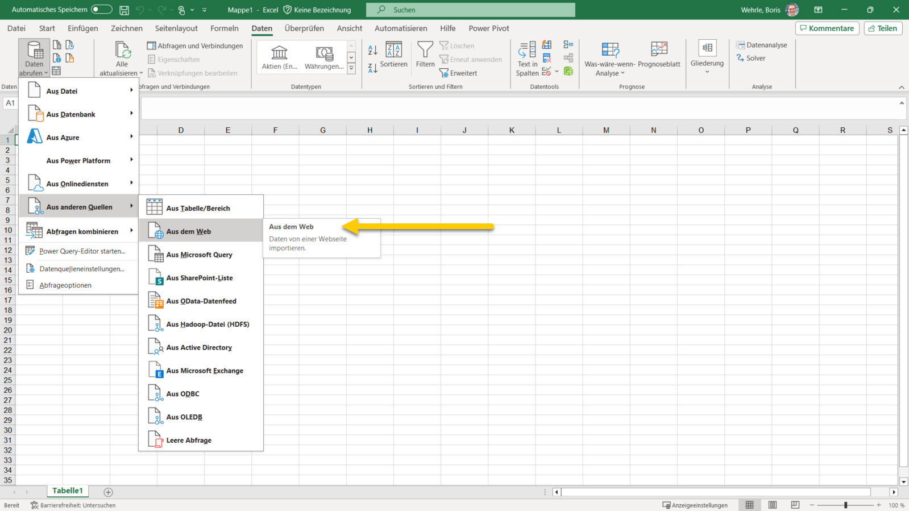
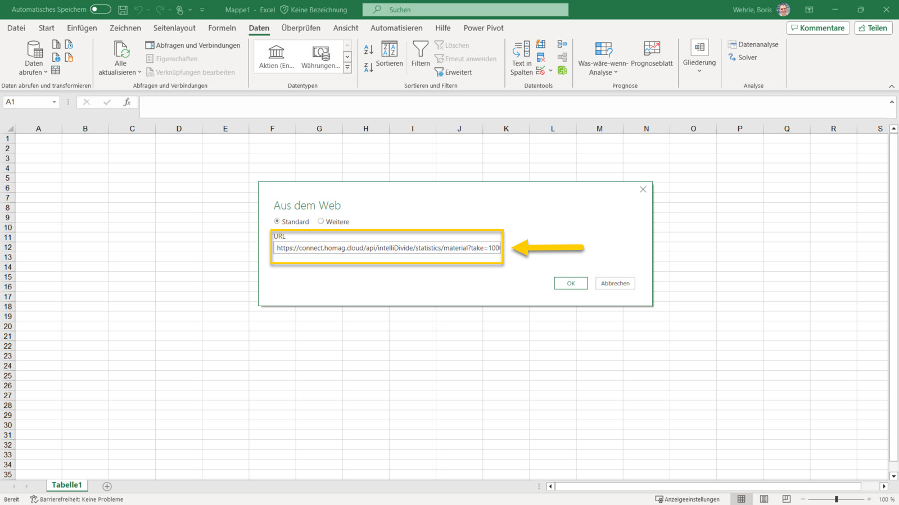
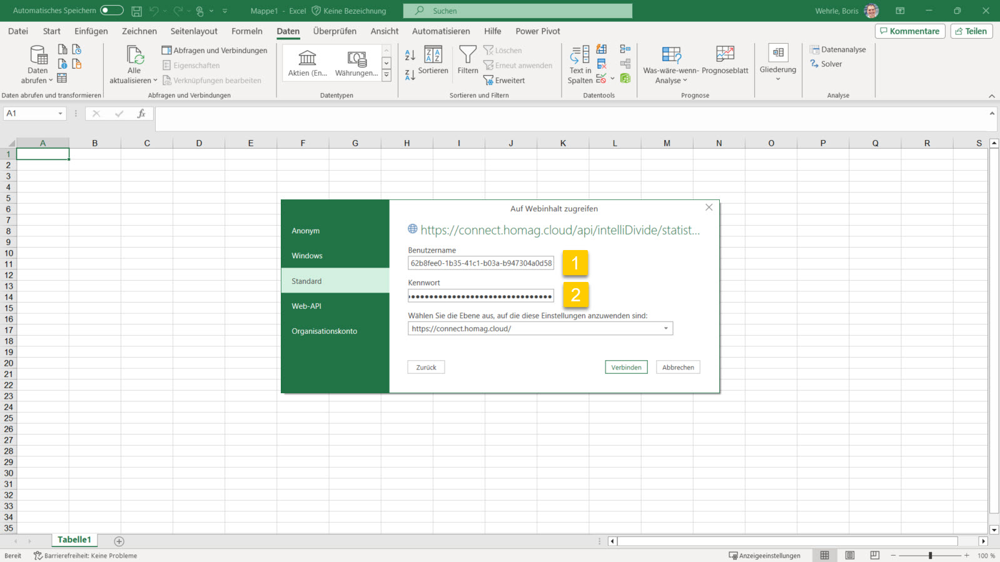
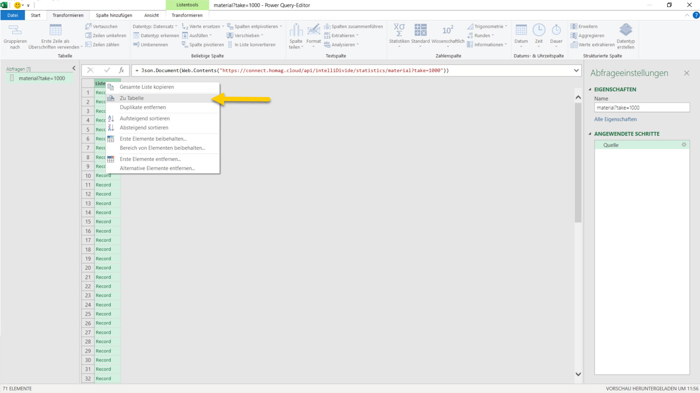
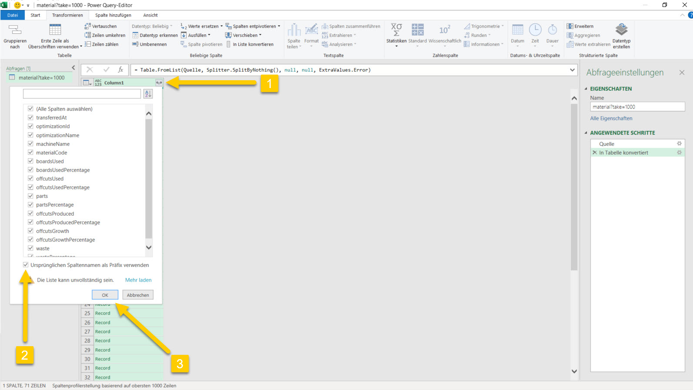
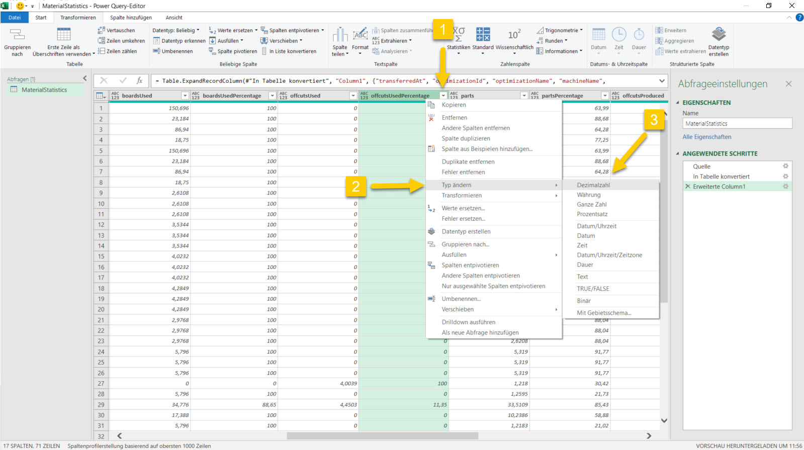
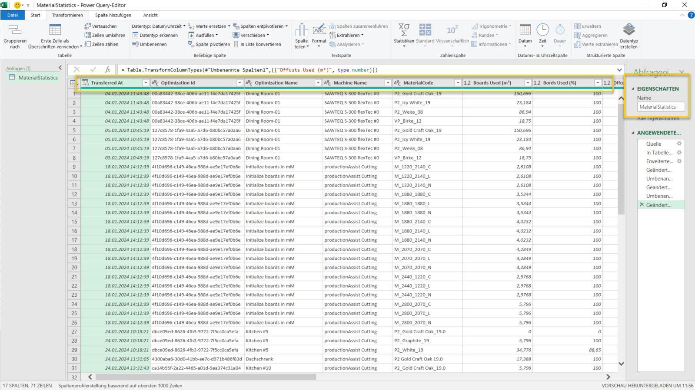
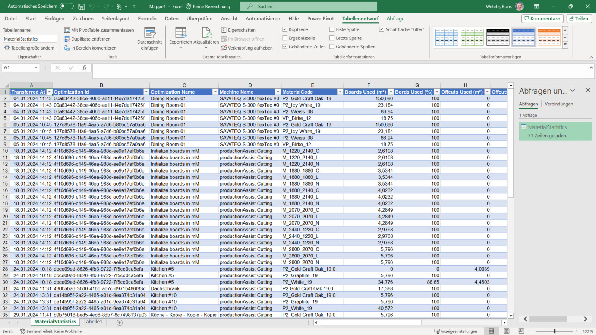
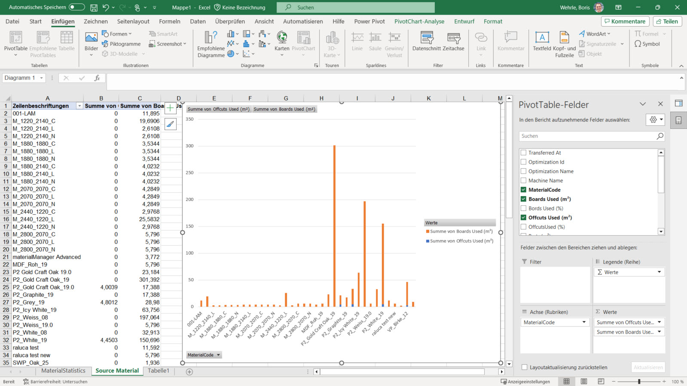

# Anaylze intelliDivide Material Statistics data using Excel

Microsoft Excel is a powerful tool for analyzing and visualizing data. 

<strong>To analyze the data the following steps are necessary:</strong>

Define a new web data source.

Enter the URL for the Material Statistics API, as described on the [Material Statistics page](Readme.md) (e.g. https://connect.homag.cloud/api/intelliDivide/statistics/material?take=1000). 

Enter Subscription Id (1) and Authentication Key (2): You can find the Subscription Id and Authentication Key on the [Authorization](../../../../../../../Documentation/Authentication/Readme.md) page. Copy and paste these values into the appropriate fields.

Convert the column to a table.

Expand the table columns.

Change the data types of the columns.

Rename table and columns to make them easier to use in reports. 

Once you have made any necessary changes to the table and columns, you can close the Query Editor and return to Excel.

Use pivot tables and charts to create comprehensive reports.

A sample reports can be found at [MaterialEfficiency.xlsx](MaterialEfficiency.xlsx).

