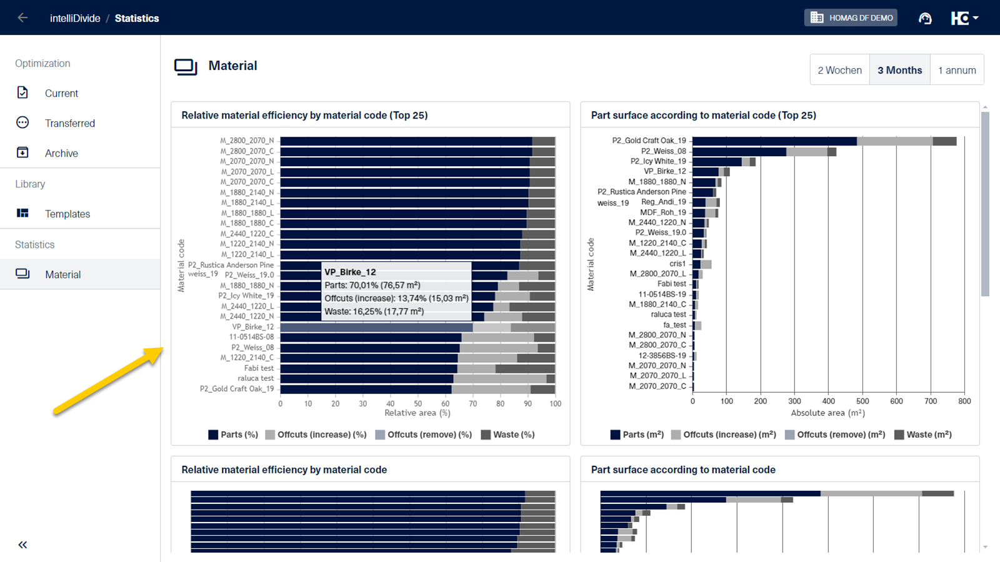

# Statistics Material

For customers with advanced and premium licenses, intelliDivide provides some basic statistics within the application.

The underlying data can be accessed via HOMAG Connect. This enables the creation of more detailed reports.

<strong>Endpoint:</strong> https://connect.homag.cloud/api/intelliDivide/statistics/material?take{take}&from={from}&to={to}&skip={skip} 
<strong>Endpoint:</strong> https://connect.homag.cloud/api/intelliDivide/statistics/material?take{take}&daysBack={daysBack}&skip={skip}

Parameter|Sample|Desription
------|------|------
take|take=10000|The take parameter is used to limit the number of rows that will be retrieved in a query. This is useful for improving performance by reducing the amount of data that needs to be transferred. The maximum value is 1.000. If more data needs to get retrieved the parameter must be used togehther with the skip parameter.
from|from=2024-01-01|The from parameter is used to define the start date for a date range filter in a query. If the from parameter is not specified, a default start date will be used. In this case, you mentioned that the default start date is 3 months ago from the current date.
to|from=2024-02-29|The to parameter is used to set the end date for a date range filter in a query. If the to parameter is not specified, a default end date is used. In this case, the default end date is the current date.
daysBack|daysBack=14|This parameter is an alternative for the parameters from and to
skip|skip=0|Optional. The skip parameter allows you to specify the number of rows to skip before starting to return data. This is useful for implementing pagination when combined with the take parameter. 

The endpoint can be used in various clients to access the data.

- [Access data using the HOMAG Connect Client](Client/Readme.md) 
- [Anaylze data using Microsoft Power BI](PowerBI/Readme.md)
- [Anaylze data using Microsoft Excel](Excel/Readme.md)

