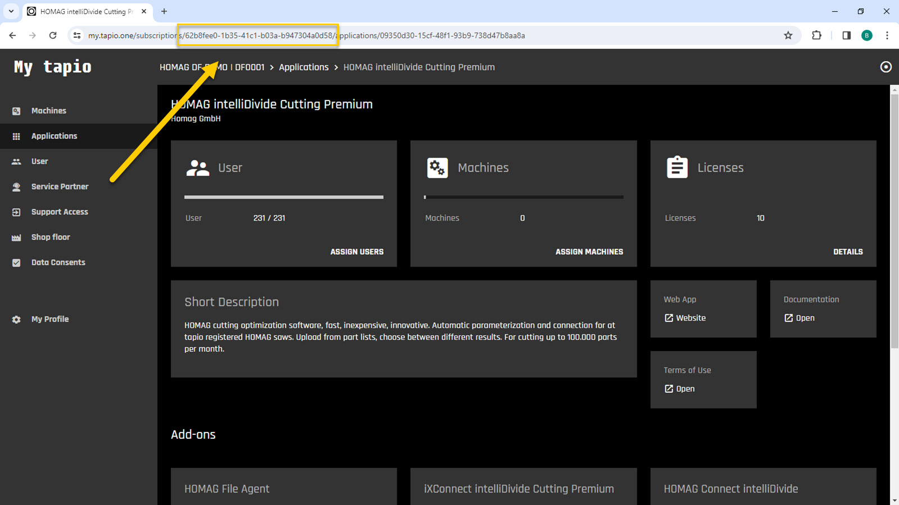
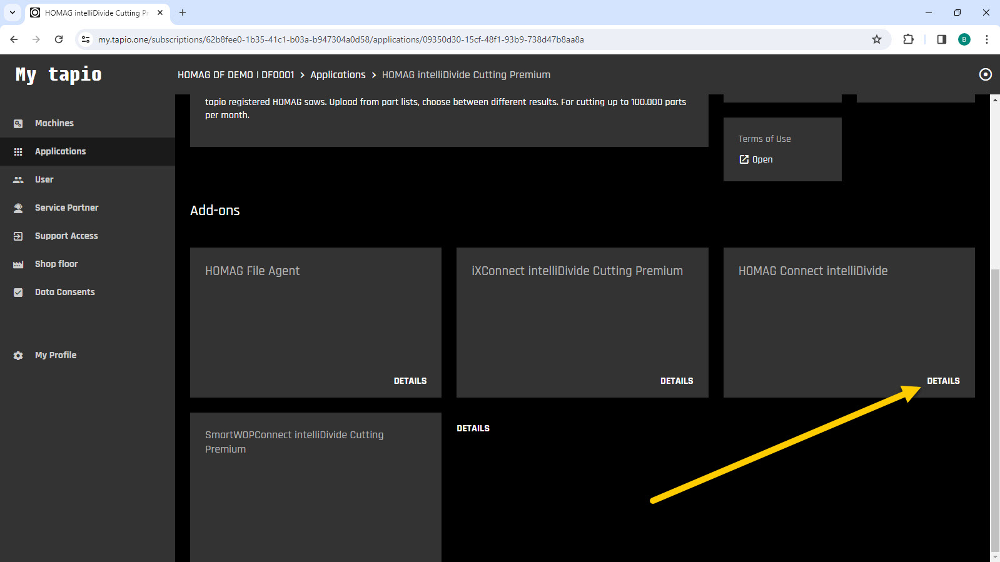
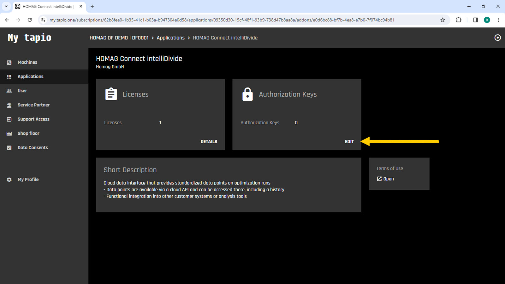
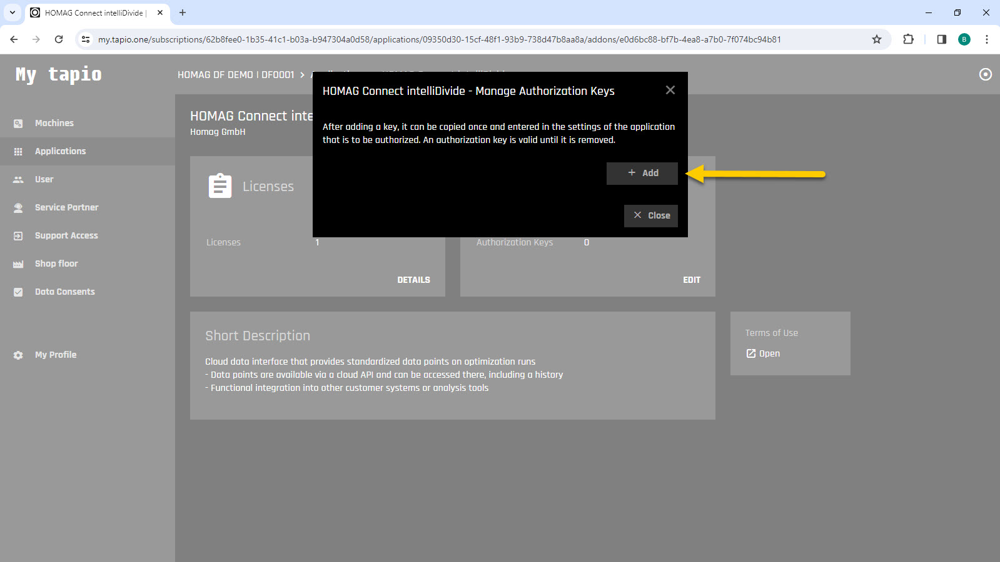
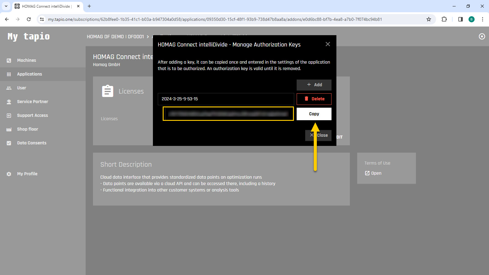

# Authentication / Authorization

A HOMAG Connect materialManager license is required to access the HOMAG materialAssist client interface. This license can be purchased as an add-on to materialManager from tapio.

To create an instance of the client, you will need both a Subscription Id and a Authorization Key. 

```c#
// Create new instance of the intelliDivide client:
            
var client = new MaterialAssistClient(subscriptionId, authorizationKey);
``` 

Both can be obtained by subscription administratos following these steps:

- Log in to your Tapio account at https://my.tapio.one.

- Copy the Subscription Id from the browser bar.



- Navigate to the materialManager in the applications section.

- Navigate to the HOMAG Connect materialManager details in the Add-ons section.



- Open the Authorization Keys dialog.



- Click on Add and Confirm to create a new key. 
Enter a meaningful description for your authorization key so that you can easily identify the correct key later if you wish to revoke it.



- Copy the generated Authorization Key



<strong>Note:</strong> Make sure to keep your access token confidential as it provides authorized access to the apps.

The file [AuthenticationSamples.cs](AuthenticationSamples.cs)  provides several examples for authorization. 