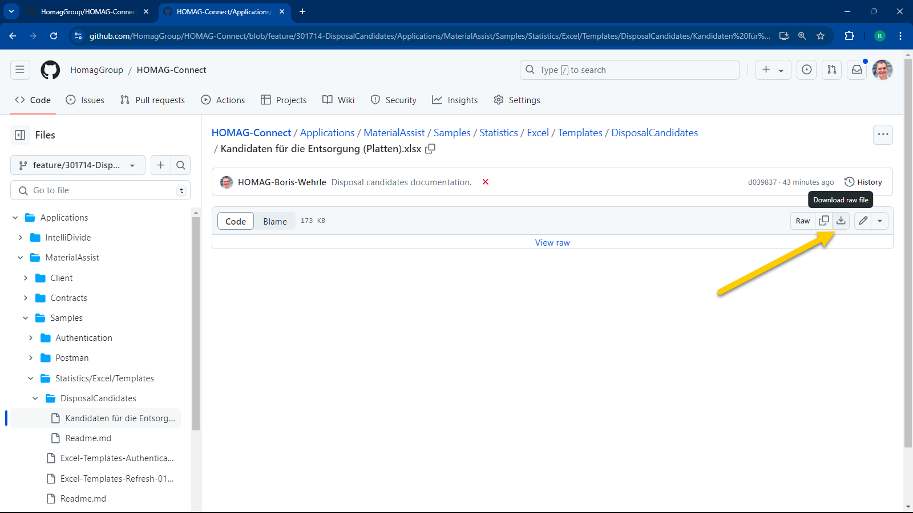
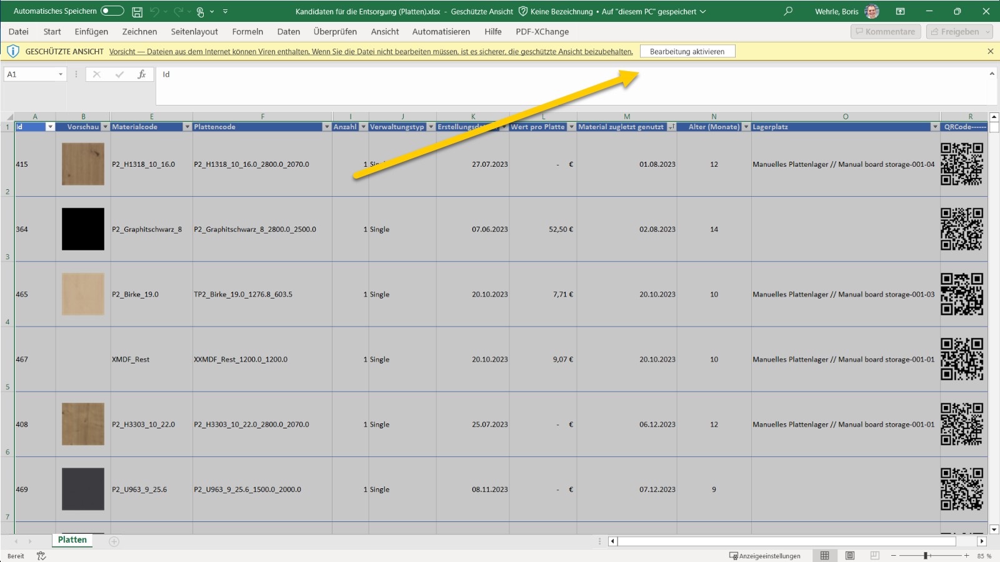
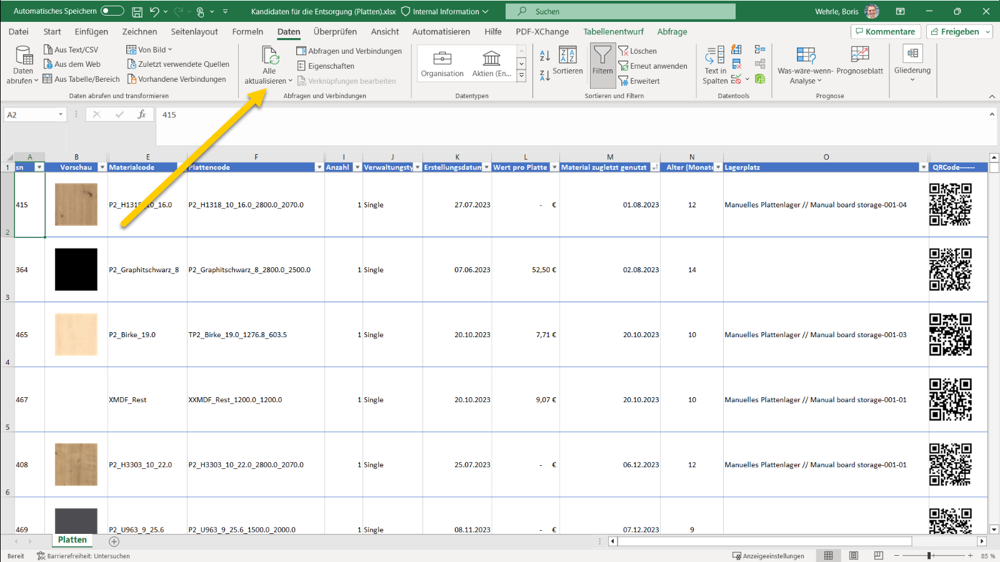
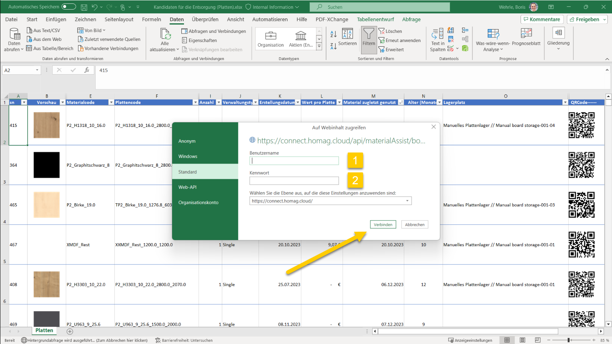

# Utilize Templates to Analyze Material Data with Excel

The data retrieved from the materialManager and materialAssist API can be used to create comprehensive reports within Excel.  

We have developed templates that can be used as a basis for creating your own customized reports.

## Templates

- [Board disposal candidates](DisposalCandidates/Readme.md) 
The report lists board entities by age and material last used date, with those at the top being potential candidates for disposal due to low likelihood of use, taking up storage space.

## How to use the templates

Download the template you want to use.

Open the template in Excel and activate editing.

In the ribbon section data click on <strong>Refresh all</strong> to retrieve the data from the API.

Enter Subscription Id (1) and Authentication Key (2). Please check the [Authorization page](../../../Authentication/Readme.md) for more information about how to get them.

The excel file is now connected to your subscription and ready to use. 

The authentication informationen is stored in the Excel file. When you open the file again, you can refresh the data without entering the authentication information again.

