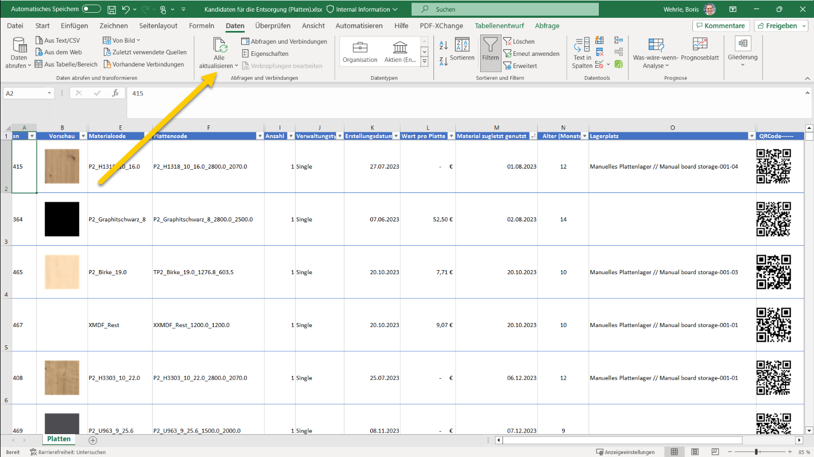
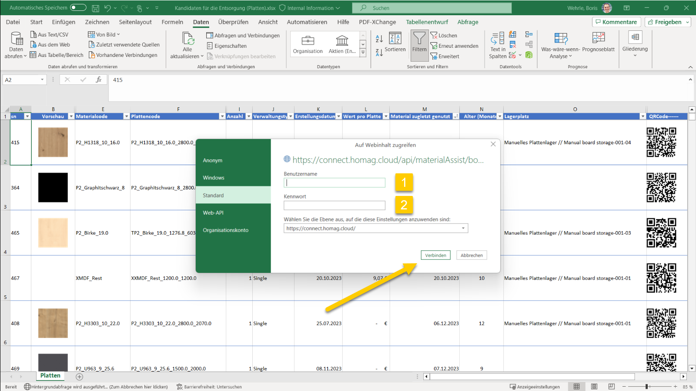

# Utilize Templates to Analyze Material Data with Excel

The data retrieved from the materialManager and materialAssist API can be used to create comprehensive reports within Excel.  

We have developed templates that can be used as a basis for creating your own customized reports.

## Templates

- Disposal candidates: [MaterialDisposalCandidates.xlsx](MaterialDisposalCandidates.xlsx)

## How to use the templates

- Download the template you want to use.
- Open the template in Excel.

In the ribbon section data click on <strong>Refresh all</strong> to retrieve the data from the API.

Enter Subscription Id (1) and Authentication Key (2): You can find the Subscription Id and Authentication Key on the [Authorization page](..\..\..\..\AuthenticationSamples\Readme.md). 

Copy and paste these values into the appropriate fields.

