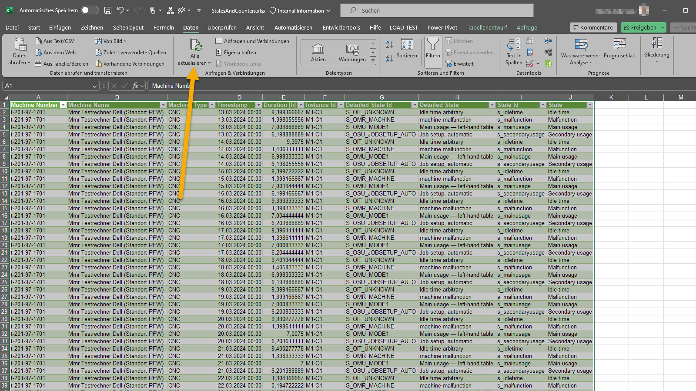
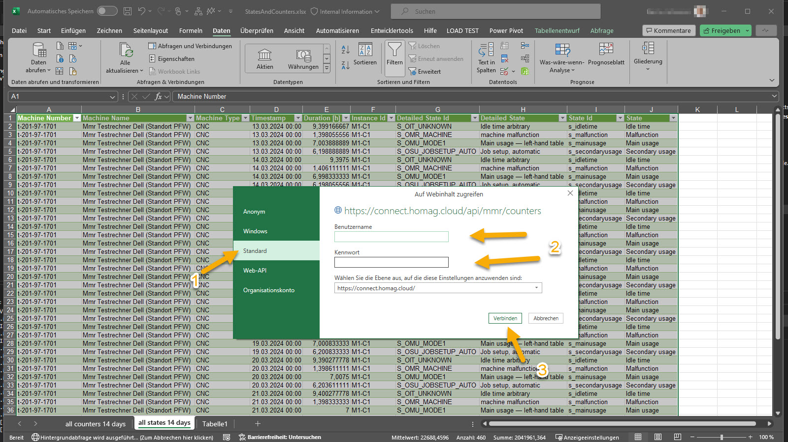
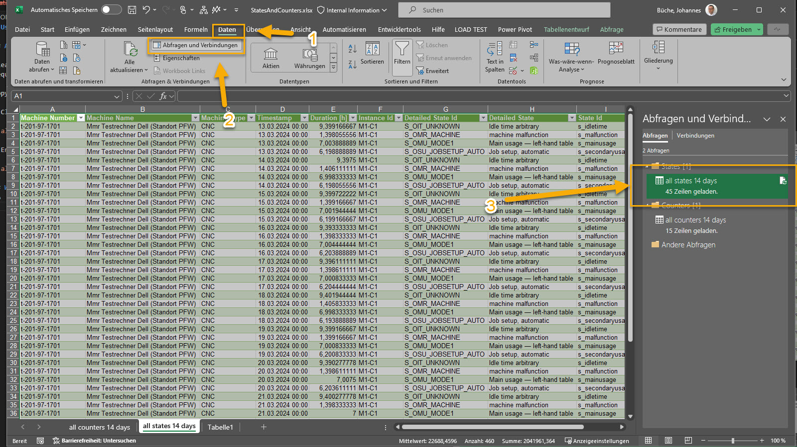
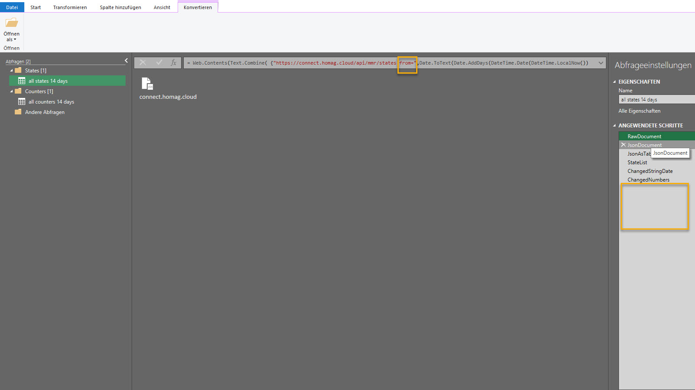

# Use the HOMAG CONNECT API from Excel

## Authorization

Please follow the common steps described [here](./../Authorization/README.md) to get the required subscriptionId and AuthorizationKey

Copy and open sample excel file and apply these steps:

- Click on "Refresh all".

- Enter the required credentials

## Working with powerQuery (advanced users)

- Activate ConnectionManager and doubleclick on one of the queries

- change the result from API (calculations, grouping, ...). Hint: You can change the evaluation period by changing the parameters from and to.

