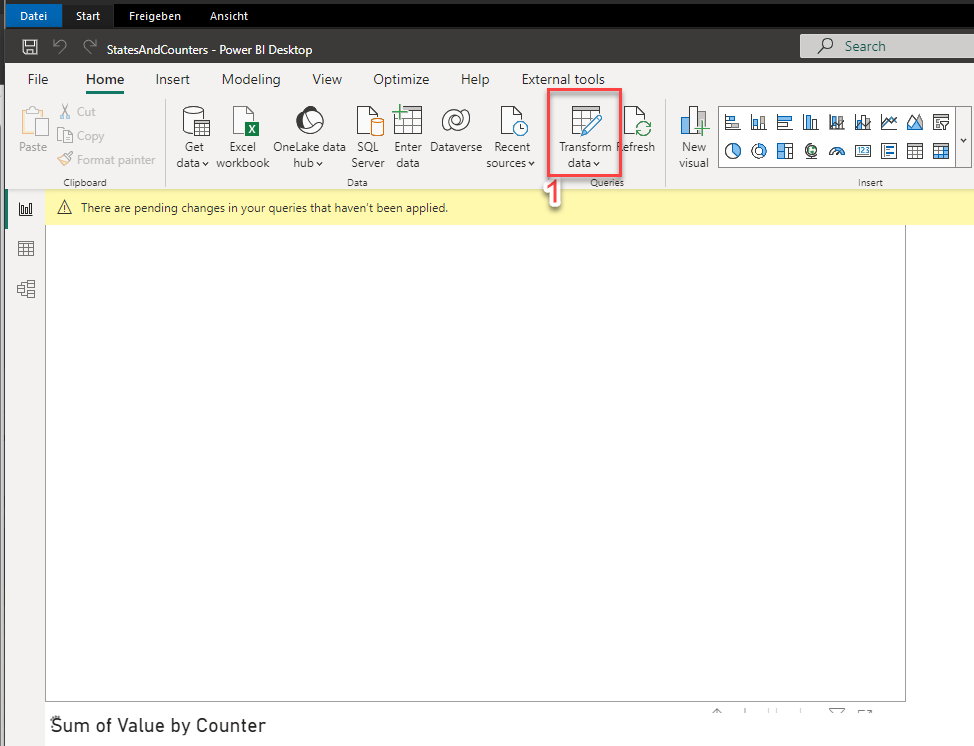
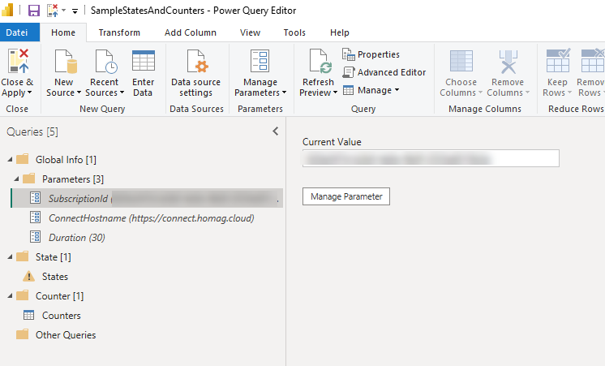
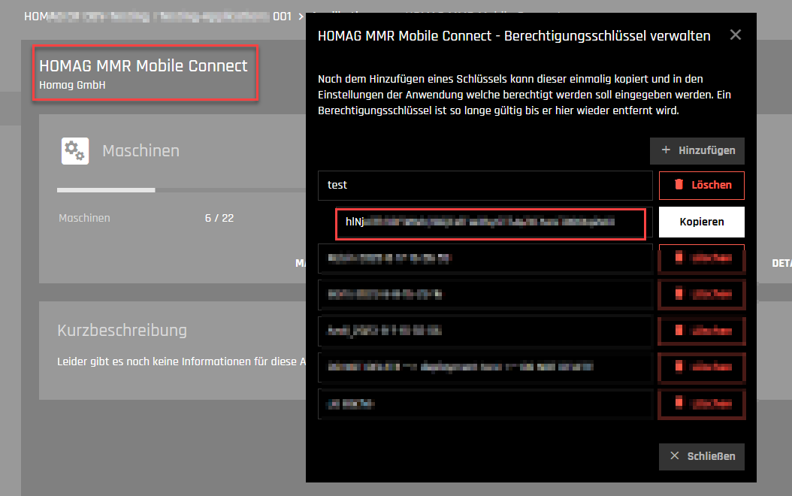
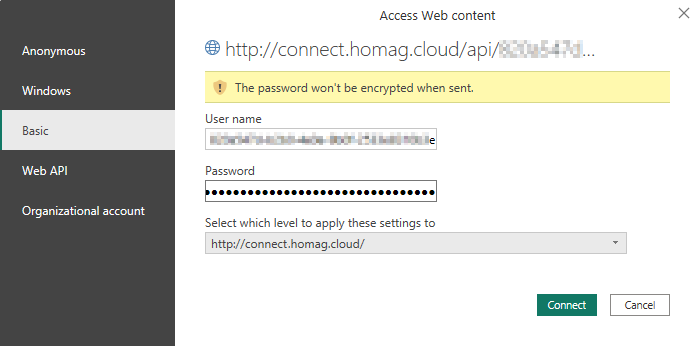
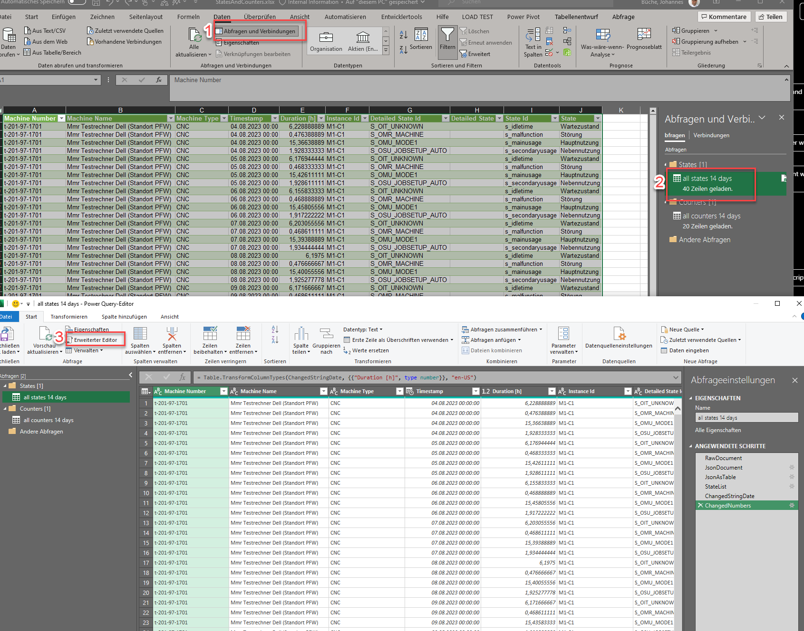

# HOMAG API Gateway Client

The following repository contains the **HOMAG API Gateway Client**, the [documentation](./Documentation/README.md) and [some samples](./Samples/README.md) for the usage.

With these packages you can easily integrate different workflows of HOMAG applications into your own application. For further details and prerequisites for using the API client, please see the documentation.

# TL;DR

~~~bash
mkdir test-homag-api-gateway
dotnet new console
dotnet nuget add source https://api.nuget.org/v3/index.json -n nuget.org
dotnet add package HomagGroup.DigitalFactory.ApiGateway.Client
~~~

~~~csharp
using HomagGroup.DigitalFactory.ApiGateway.Client.Services;
using System.Text;

Console.WriteLine("Hello at the HOMAG API Gateway");

var client = new HttpClient();
client.BaseAddress = new Uri("https://api-gateway.homag.cloud");
Console.WriteLine("Please insert your token:");
var token = Console.ReadLine();
var credentials = Convert.ToBase64String(Encoding.UTF8.GetBytes($"8878FEF1-E271-402D-B3C1-296FCBF7A854:{token}"));
client.DefaultRequestHeaders.Authorization = new System.Net.Http.Headers.AuthenticationHeaderValue("Basic", credentials);

var productionServices = new ProductionServices(client);
var workplaces = await productionServices.PMGetFeedbackWorkplaces();

Console.WriteLine($"We found {workplaces.Workplaces.Count} workplaces in your subscription.");
~~~

~~~bash
dotnet run
~~~

## Getting started

1. Clone the repository

~~~bash
git clone https://dev.azure.com/homag-group/FOSSProjects/_git/homag-api-gateway-client
cd homag-api-gateway-client
~~~

2. Get your personal access token from [https://my.tapio.one](https://my.tapio.one)

    1. If you know your *Subscription ID* you can just insert this in the link below and continue with 3.

    [https://my.tapio.one/subscriptions/<Subscription ID>/applications/74fbbd3c-af43-4630-928b-e4022995fd02/addons/0e120a01-126a-4a19-a9b8-bbfc543345c1](https://my.tapio.one/subscriptions/<Subscription ID>/applications/74fbbd3c-af43-4630-928b-e4022995fd02/addons/0e120a01-126a-4a19-a9b8-bbfc543345c1)

    2. If you don't know your *Subscription ID* just go to [https://my.tapio.one](https://my.tapio.one). Select your subscription, select **Applications**, open **HOMAG productionManager** and click on **HOMAG File Agent**.

    3. Click on **Edit** and click on **Add**. Insert a name for your token, confirm and copy the token to your clipboard.

    4. Copy *Samples/appsettings.json* to *Samples/appsettings.test.json*

    ~~~bash
    cp Samples/csharp/HomagGroup.ApiGateway.Client.Samples/appsettings.json Samples/csharp/HomagGroup.ApiGateway.Client.Samples/appsettings.test.json
    ~~~

    5. Insert your access token in the *Samples/appsettings.test.json*. It should look like below.

    ~~~json
    {
        "HomagApiGateway":
        {
            "BaseUrl": "https://api-gateway.homag.cloud",
            "Username": "8878FEF1-E271-402D-B3C1-296FCBF7A854", // Keep this username for your requests
            "Token": "" // Use your personal access token from tapio
        }
    }
    ~~~

3. Build the solution

~~~bash
dotnet build
~~~

4. Run tests

~~~bash
dotnet test --filter TestCategory!=UserTestNoInteractionNeeded
~~~

## Use in powerBI

1. get the file sample from this repository and open it

"StatesAndCounters.pbix"

2. Click on "Transform data"

3. Adjust the Parameters

You must add here your subsiptionId (from tapio) and perhaps adjust the number of days, for which you want to get data

4. Adjust credentials

The username is the name of your tapio-account (see it in the url of your browser, when you are in the management view)

The password is the key, you are creating for each Connect-App

Please add these data in the Credentials dialog

5. Work with the data
Hit Close and Apply button in the ribbon

## Use data in excel
1. Copy the sample excel-file "StatesAndCounters.xlsx"

2. Go to the powerQuery Management

- Click on Queries in the ribbon (1)
- doubleclick one of the queries (2)
- select the first query and click on "advanced editor"(3)

3. change the

## Contribute

If you find anything, feel free to contribute to this repository. We are happy for every improvement ❤️.
