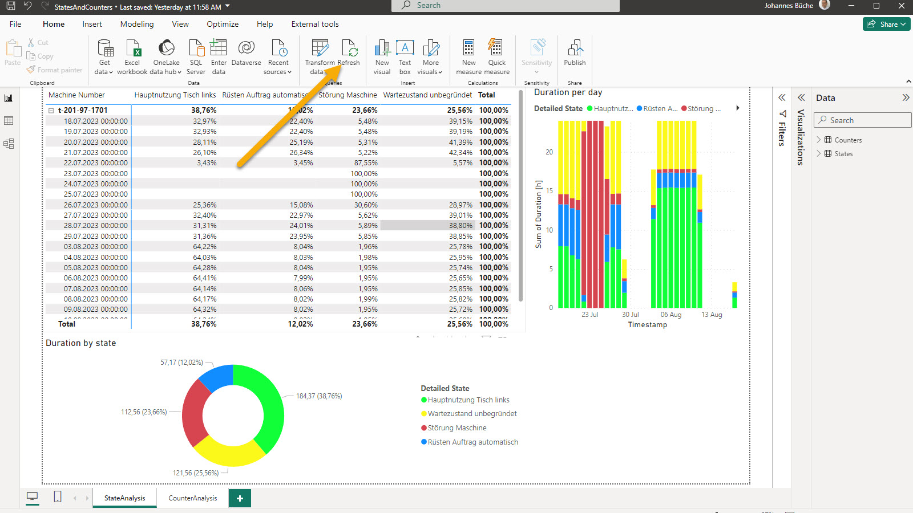
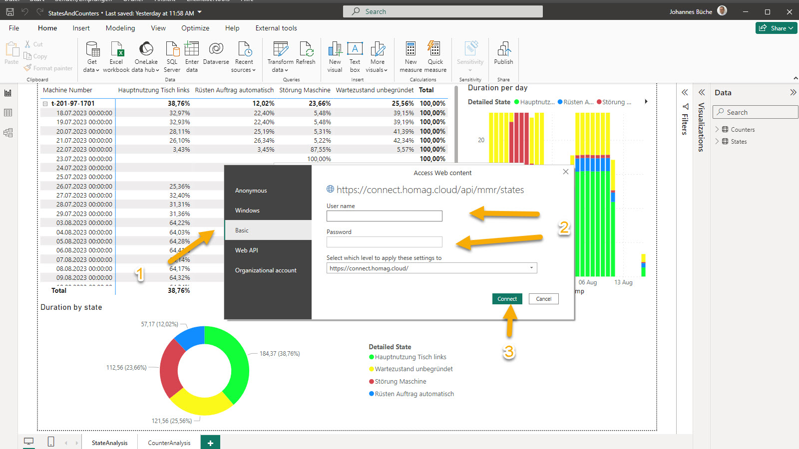
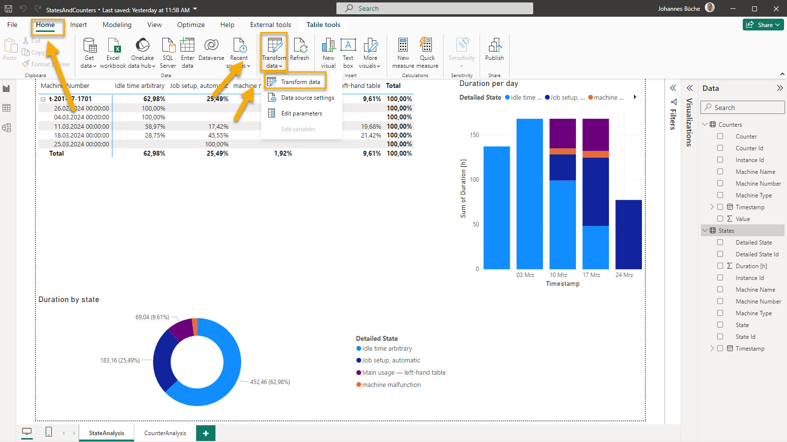
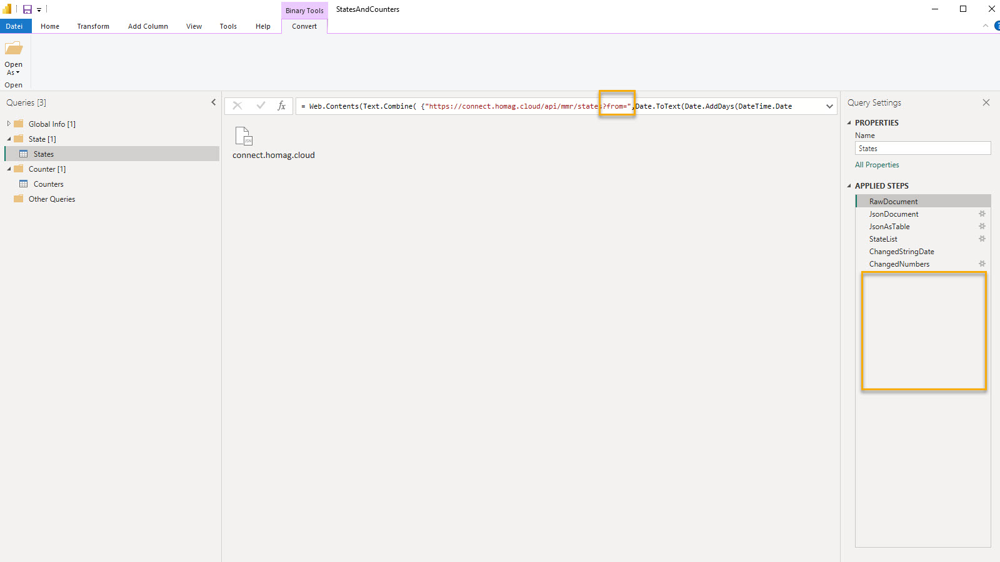

# Use the HOMAG CONNECT API from powerBI

## Authorization

Please follow the common steps described [here](./../Authorization/README.md) to get the required SubscriptionId and AuthorizationKey

Copy and open sample powerBI file and apply these steps:

- Click on "Refresh".

- Enter the required credentials

## Working with powerQuery (advanced users)

- Select "Transform data" in powerBI

- change the result from API (calculations, grouping, ...). Hint: You can change the evaluation period by changing the parameters from and to.

