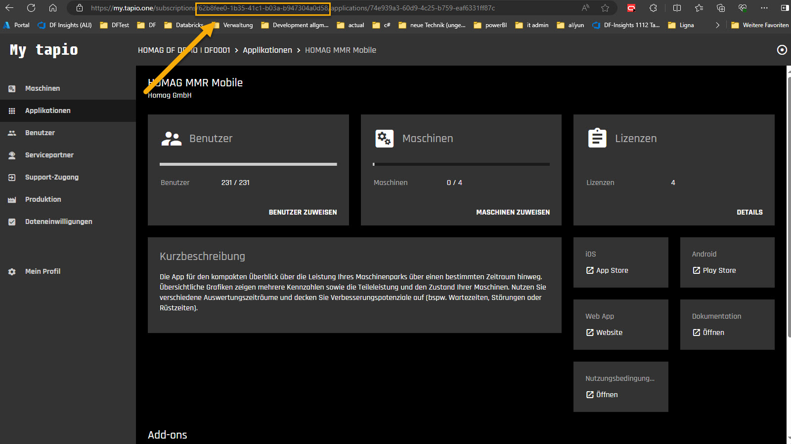
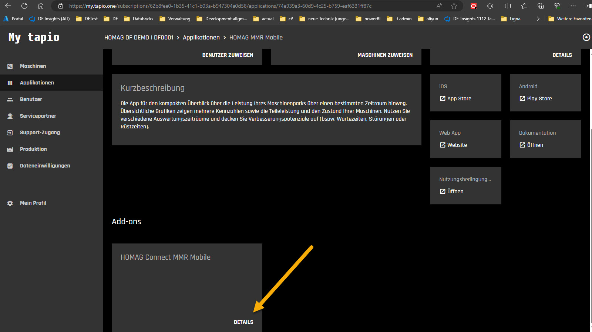
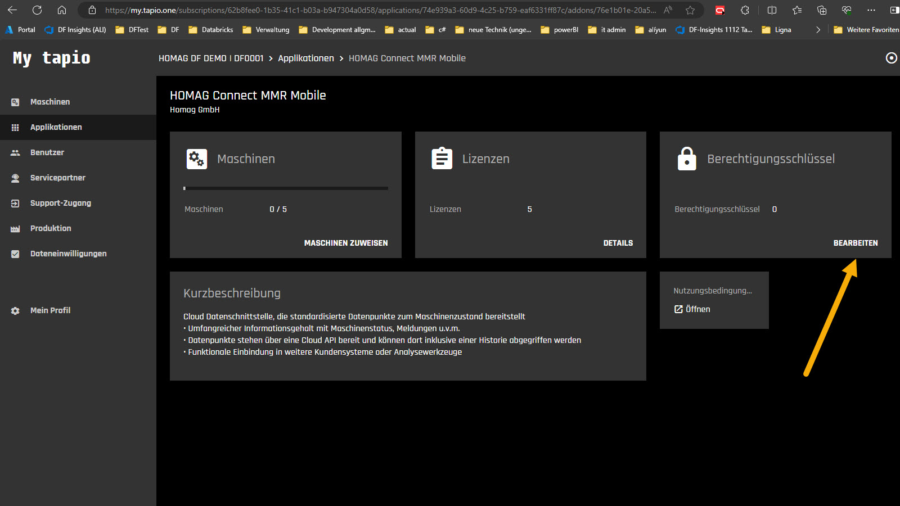
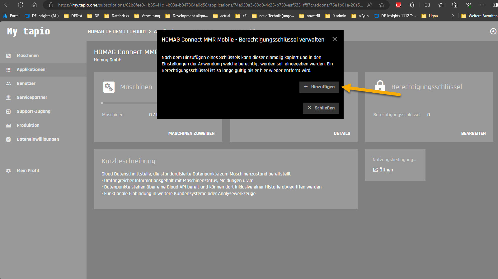
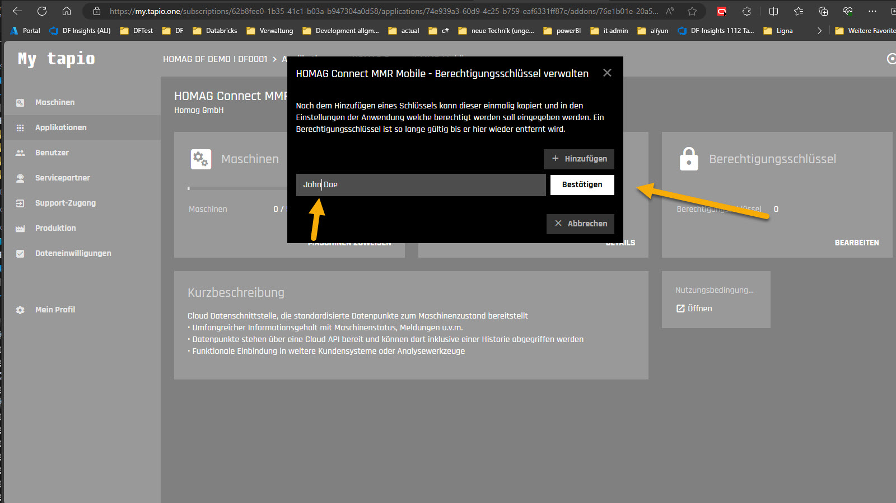
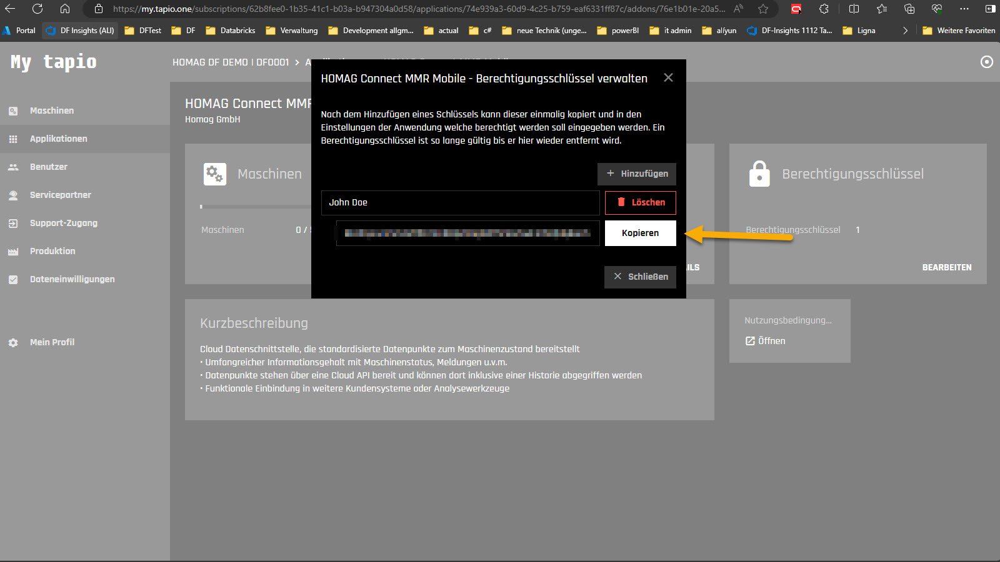

# Authorization

To access the HOMAG MmrMobile Client Interface, a "HOMAG MMR Mobile advanced" License is required. 

To create an instance of the client, you will need both a SubscriptionId and a AuthorizationKey.

```c#
// Create new instance of the MmrMobile client:
            
var client = new MmrMobileClient(subscriptionId, authorizationKey);
```

Both can be obtained by subscription administratos following these steps:

- Log in to your Tapio account at <https://my.tapio.one>.

- Copy the Subscription Id from the browser bar.



- Navigate to the HOMAG MmrMobile in the applications section.

- Navigate to the HOMAG Connect MmrMobile details in the Add-ons section.



- Open the Authorization Keys dialog.



- Click on Add to create a new key.



Enter a meaningful description for your authorization key so that you can easily identify the correct key later if you wish to revoke it.
Then click on confirm.



Copy the generated Authorization Key. Please store the key in a safe location. If you forget the key, you only can delete it and request a new one.


**Note:** Make sure to keep your access token confidential as it provides authorized access to the apps.
