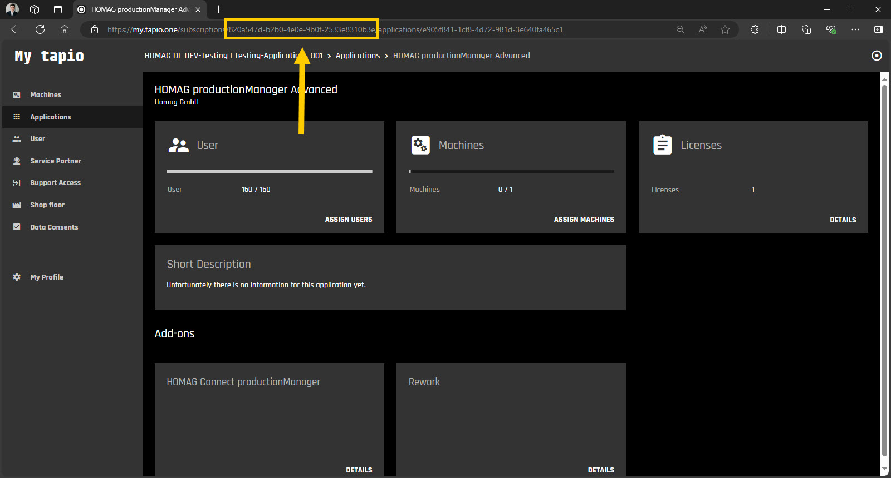
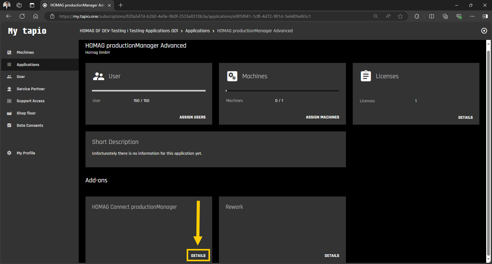
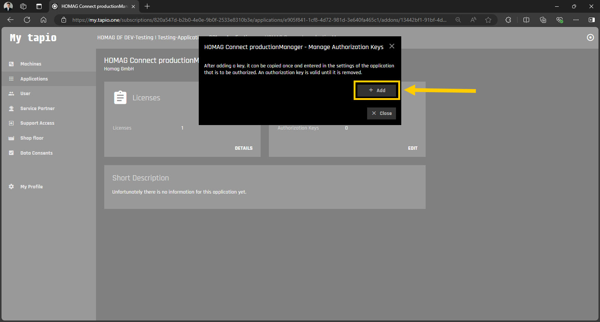
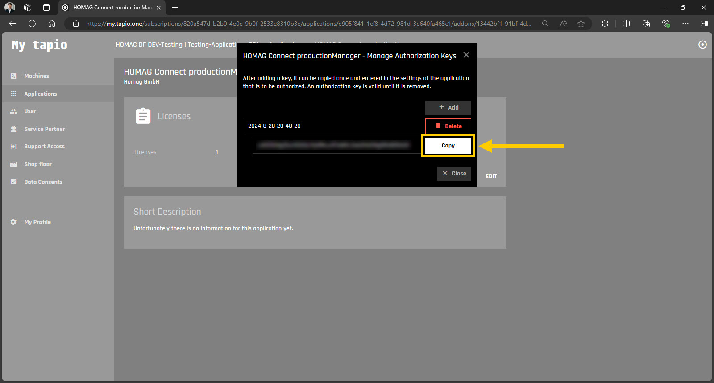

# Authentication / Authorization

To access the HOMAG productionManager Client Interface, a _HOMAG Connect productionManager_ license is required. This license is included in the _productionManager Advanced_ and _productionManager Premium_ licenses.

To create an instance of the client, you will need both a _subscription Id_ and an _authorization key_. 

```c#
// Create new instance of the productionManager client:
            
var client = new ProductionManagerClient(subscriptionId, authorizationKey);
``` 

Both can be obtained by subscription administrators following these steps:

- Log into your tapio account at https://my.tapio.one.

- Copy the subscription Id from the browser bar.



- Navigate to the productionManager in the applications section.

- Navigate to the HOMAG Connect productionManager **DETAILS** in the add-ons section.



- Open the "Authorization keys" dialog by clicking **EDIT**.


- Click on **+ Add** and **Confirm** to create a new authorization key. 
Enter a meaningful description for your authorization key so that you can easily identify the correct authorization key later if you wish to revoke it.



- Copy the generated authorization key by clicking **Copy**.



<strong>Note:</strong> Make sure to keep your access token confidential as it provides authorized access to the apps.

The file [AuthenticationSamples.cs](AuthenticationSamples.cs) provides several examples for authorization. 
