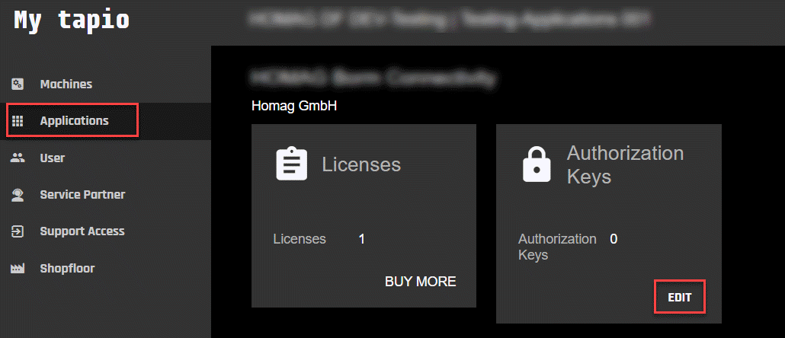
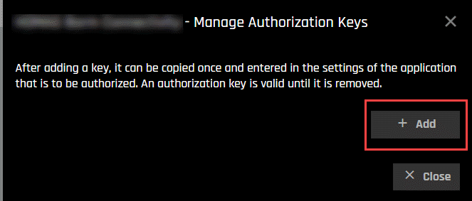
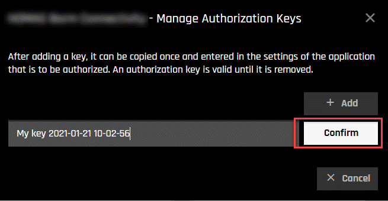
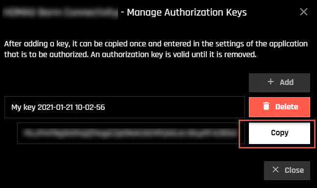
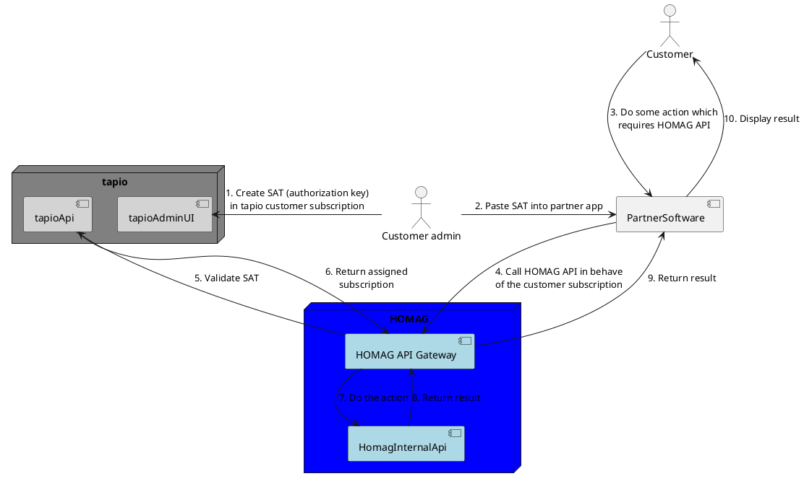
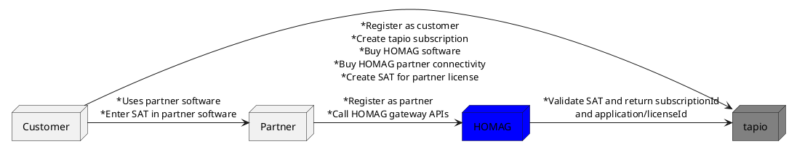

# HOMAG Connect Base

## Version history

Version | Date     | Comment 
--------|----------|---------
0.7     |31.08.2023| First Draft

## Introduction

HOMAG Connect is the central hub for external applications to communicate with HOMAG applications.
Each partner needs to register with HOMAG and tapio in order to use this communication interface.

### Terms

Term                      | Description
--------------------------|--------------------------------------------------------------------------
Homag Connect             | A central gateway for communicating with HOMAG applications. It is deployed worldwide on different regions. The call will automatically be routed to the nearest endpoint / region.
SAT                       | Subscription Access Token (similar to a PAT (Personal Access Token)). It can be created in the tapio admin UI by the customer; also it can be revoked if needed. This SAT must be created by the end customer and stored inside the partners application for this customer. It is then passed to the API gateway to authenticate the access. In tapio this is also called `Authorization key`.
HOMAG partner id          | Each partner is assigned a unique partner id. This id must be passed in each call to the API gateway. It is mainly used to identify the calling application (it is more an information). The authentication is still done with the SAT.

### Partner / developer experience

The partner must register at HOMAG. Then the partner gets an partner id and can then start to call Homag Connect with this partner id and the SAT for the chosen application (MMR Mobile, intelliDivide, etc.), which was created within an tapio subscription.

### Customer experience

The customer need to buy the according license from tapio or HOMAG. It will then be assigned to his tapio subscription.

Then he need to go to the "Applications" section and create a SAT and copy this into the local application of the partner.

1. Go the the correct license and add a SAT

2. Add an authorization key (SAT)

3. You can enter a name, so that you can later identify this token better. This name is only for displaying and identifying the token

4. After confirming, you must copy the generated token by pressing the "Copy" button. This token cannot be retrieved after you close this dialog.

5. The customer must paste this SAT into the partner application.

## Customer Workflow and System Context

### Customer Workflow

<!---

--->

### System Context

<!---

--->

## Interface description

### Overview

#### Authentication

We use [basic authentication](https://swagger.io/docs/specification/authentication/basic-authentication/).
The username is the given from HOMAG, which is your `HOMAG partner id` and the password is the provided SAT from the customer in your application.

#### Additional header data

##### Additional data / tracing

We request the partners to provide some additional information in the headers (like software version / software features / ...), so we can track down problems easier, with this data. Be sure not send any data which are user-related to comply with GDPR.

We support the following headers for tracing:

* `traceparent`
* `tracestate`

For more information, please refer to the [W3C Trace Context - Level 1 specification](https://www.w3.org/TR/trace-context/).

### REST APIs

#### Host

* Production system =  `https://connect.homag.cloud`
* Test system =  `https://preview-connect.homag.cloud`

#### Error handling / response

If an error occur, we normally return the problem details as a json object in the response. This is done for all HTTP status codes >= 400.
The main properties are:

* title: A human readable title
* detail: An explanation of the error
* operationId: An reference to our internal logging system, so we can also find the corresponding request in order to dig down the problem

For more information, please refer to [RFC7807](https://tools.ietf.org/html/rfc7807).

### Interface overview

#### Homag Connect MMR Mobile interface
Follow the [link](/Applications/MmrMobile/Documentation/README.md#)

