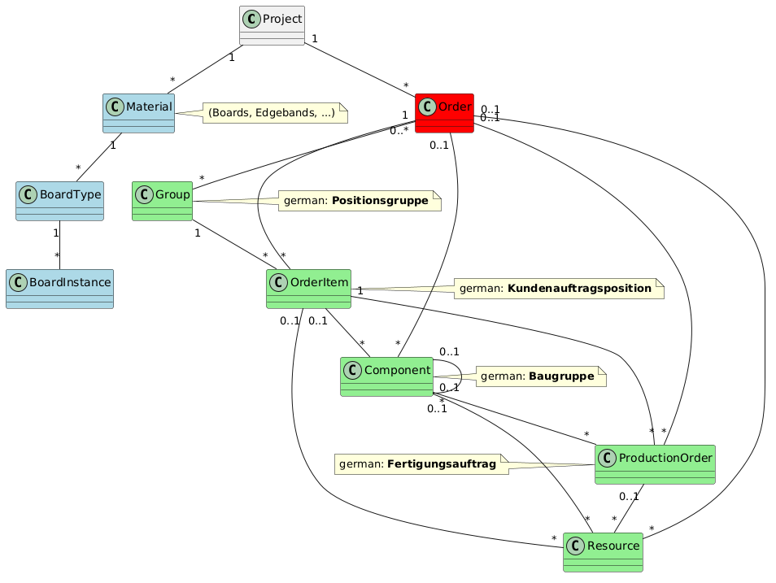
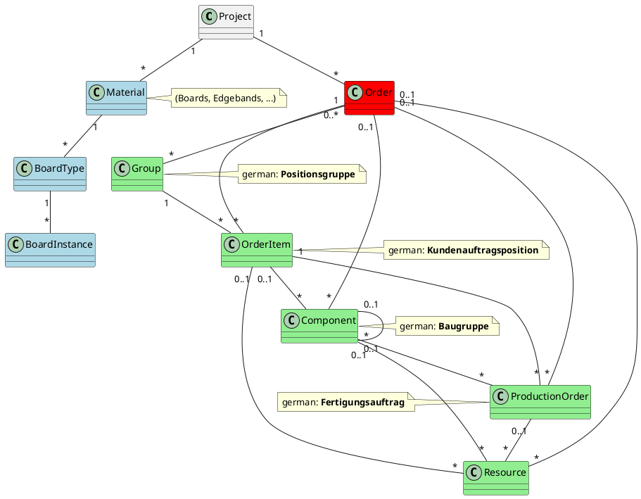
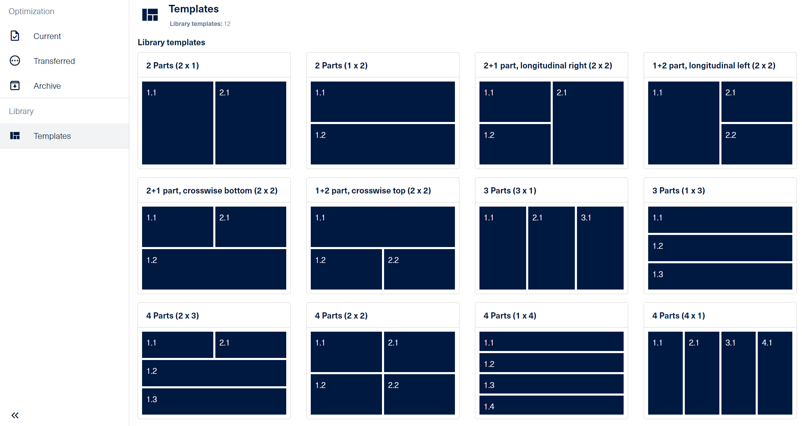

# Documentation of import/export definition for HOMAG digital products

## Version history

Version | Date       | Comment
--------|------------|---------------------------------------------------------------------------------------------
0.9     | 17.02.2020 | First Draft
1.0     | 17.07.2020 | Add 3 missing fields (ProcurementType (Dispositionsart), ProductionRoute (Fertigungsweg) and AdditionalComments. Extended supported filetypes for images
1.1     | 28.07.2020 | Add new field CncProgramName2
1.2     | 17.11.2020 | Formatting issues
1.3     | 20.11.2020 | Added ExternalId for each entity and order
1.4     | 26.11.2020 | Comment on quantity. Always use the multiplied value over the hierarcchy
1.5     | 22.01.2021 | Extended import with intelliDivide specific fields/properties<br/>Renamed "Typ" to "Type" (both are supported in productionManager)<br/>Renamed "EdgeDiagramm" to "EdgeDiagram" (both are supported in productionManager)
1.6     | 25.01.2021 | Small clarifications and spelling corrections
1.7     | 27.01.2021 | Added support for board imports in intelliDivide<br/>(see also HOMAG API gateway)
2.0     | 28.01.2021 | Unification of intelliDivide and productionManager imports specification<br/>Added `contentVersion` attribute (current version is `2`)<br/>Added `materials` element
2.1     | 01.02.2021 | Fixed cutting sample
2.2     | 03.02.2021 | Removed BoardType and EdgeBandType
2.3     | 15.03.2021 | Added clarification for Board StockQuantity
2.4     | 19.03.2021 | Extended intelliDivide example
2.5     | 28.04.2021 | Added missing "not null" field information to pM import
2.6     | 07.06.2021 | Added "CompletionDatePlanned" property to pM import
2.7     | 21.12.2021 | Import of SecondCutLength/Width in pM and iD (CuttingLength/Width will only be used im pM for backward compatibility)
2.9     | 22.12.2021 | Added "MPR:" prefix for passing nesting properties
2.10    | 26.01.2022 | Corrected overview diagram / clarification about date/time (RFC3339) / fixed image link example
2.11    | 26.01.2023 | Corrected nesting import example and description for mpr(x) file reference
2.12    | 01.02.2023 | RotationAngle clarification for iD nesting
2.13    | 28.02.2023 | Added 5 missing fields (Company, Project, Customer number, Notes and Person in charge)
2.14    | 06.03.2023 | Changed ExternalId to ExternalSystemId
2.15    | 17.03.2023 | Added Grain Pattern Template for parts only for cutting
2.16    | 30.06.2023 | Grain Pattern Template for cutting documentation
2.17    | 30.06.2023 | Grain Pattern Template adjustments related to the grain set available for templates
2.18    | 19.01.2024 | Updated description of CncProgramName1 and CncProgramName2
2.19    | 10.14.2024 | Added StartDatePlanned and CompletionDatePlanned.
3.00    | 20.03.2026 | Refactoring of the existing import specification (renaming, adding and removing of several properties)

## Overview

The import for productionManager AND intelliDivide requires a zip compressed file containing a defined structure.
This structure is described below.

## Definition of the zip file

The name of the zip file does not matter. The root folder must contain a "project.xml" file. The contents of the zip file must look like:

```text
+-- project.xml            // This is a fixed filename and must always be "project.xml"
+---\Images                // this can be any folder name
    +--- order.jpg         // this can be any file, which are referenced in the "project.xml"
    +--- part1.mpr         // this can be any file, which are referenced in the "project.xml"
    +--- part1_front.jpg   // this can be any file, which are referenced in the "project.xml"
    +--- part2_3d.png      // this can be any file, which are referenced in the "project.xml"
```

## project.xml structure

The project.xml file has a generic structure. The root node is "project". This then can contains a "orders" node, which can have multiple "order" elements. Also it can contains `materials` which can have multiple kind of `material` (like boards, edges, ...).

For productionManager the "order" is then the main element to import.

For intelliDivide the "project" is the main element (one optimization job might contain parts from multiple orders). It also might contain boards for optimization.

Please always add the `contentVersion` attribute to the project element.

Not all properties are used in all scenarios (like productionManager or intelliDivide). But you can always pass all properties; if the property is not used, it will be ignored. In the below specifications, there is always a scope for each property, so you can see, which property is used in which scope. The scopes are:

* productionManager: pM

* intelliDivide: iD

Here is a example of the generic structure.

### Generic project.xml example

```xml
<?xml version="1.0"?>
<project contentVersion="2">
  <properties>
    <param name="key" value="value" />
    <!-- ... -->
  </properties>
  <orders>
    <order>
      <properties>
        <param name="key" value="value" />
        <!-- ... -->
      </properties>
      <images>
        <image>
          <properties>
            <param name="key" value="value" />
            <!-- ... -->
          </properties>
        </image>
      </images>
      <entities>
        <entity>
          <properties>
            <param name="typ" value="OrderItem" />
            <param name="key" value="value" />
            <!-- ... -->
          </properties>
          <images>
            <image>
              <properties>
                <param name="key" value="value" />
                <!-- ... -->
              </properties>
            </image>
          </images>
          <entities>
            <!-- If typ=OrderItem => all subtypes must be Component or ProductionOrder or Ressources -->
            <!-- If typ=Component => all subtypes must be Component or ProductionOrder or Ressources -->
            <!-- If typ=ProductionOrder => all subtypes must be Ressources -->
            <!-- If typ=Ressources => no sub entities are allowed -->
            <entity>
              <!-- ... -->
            </entity>
          </entities>
        </entity>
      </entities>
    </order>
  </orders>
  <materials>
    <material>
      <properties>
        <param name="key" value="value" />
        <!-- ... -->
      </properties>
      <images>
        <image>
          <properties>
            <param name="key" value="value" />
            <!-- ... -->
          </properties>
        </image>
      </images>
      <entities>
        <entity>
          <properties>
            <param name="typ" value="Board" />
            <param name="key" value="value" />
            <!-- ... -->
          </properties>
          <images>
            <image>
              <properties>
                <param name="key" value="value" />
                <!-- ... -->
              </properties>
            </image>
          </images>
          <entities>
            <!-- types can have instances or sub types -->
            <entity>
              <!-- ... -->
            </entity>
          </entities>
        </entity>
      </entities>
    </material>
  </materials>
</project>
```

### Definition of a project

#### Logical Overview

Here you see an overview of the possible elements which can be used as an entity.
The green entities are the different types of "entities" which can be places below the order and below other entities.




```plantuml
@startuml
class Project
class Order #red
class Component #lightgreen
class OrderItem #lightgreen
class ProductionOrder #lightgreen
class Resource #lightgreen
class Group #lightgreen
class Material #lightblue
class BoardType #lightblue
class BoardInstance #lightblue

Project "1" -- "*" Order
Order "1" -- "*" OrderItem
Order "0..*" -- "*" Group
Group "1" -- "*" OrderItem

OrderItem "0..1" -- "*" Component
Order "0..1" -- "*" Component
Component "0..1" -- "*" Component
Component "0..1" -- "*" ProductionOrder
Order "0..1" -- "*" ProductionOrder
OrderItem "1" -- "*" ProductionOrder
OrderItem "0..1" -- "*" Resource

Order "0..1" -- "*" Resource
Component "0..1" -- "*" Resource
ProductionOrder "0..1" -- "*" Resource

Project "1" -- "*" Material
Material "1" -- "*" BoardType
BoardType "1" -- "*" BoardInstance

note right of Material
    (Boards, Edgebands, ...)
end note

note right of Component
    german: **Baugruppe**
end note
note right of OrderItem
    german: **Kundenauftragsposition**
end note
note right of Group
    german: **Positionsgruppe**
end note
note left of ProductionOrder
    german: **Fertigungsauftrag**
end note
@enduml
```

All components elements can have properties and images (which also includes all kind of other files and binary files) assigned to it.

#### Valid properties of a "project"

In the case of intelliDivide, the project corresponds to an optimization job.
ONE project/import is used for ONE optimization order.
Later version: We might create two intelliDivide jobs out of this, if we have different kind of production orders (cutting/nesting).
In case of the productionManger only the property 'UnitofLength' is valid.

Name         | Type   | Description       | Scope
-------------|--------|-------------------|-------
Type         | enum   | Cutting / Nesting | iD
Name         | string | Name of the job   | iD
Machine      | string | The id of the machine which will be used for optimization. If this machine is not found, intelliDivide will use a default machine and assume a cutting job. | iD
Parameter    | string | Parameter name for optimization. If this property set is not found, intelliDivide will use a default | iD
UnitOfLength | enum   | mm or inch        | iD/pM

#### Valid properties of an "order"

Orders may have the properties listed below. The table below is aligned to the current productionManager contracts (see `Applications/ProductionManager/Contracts/Orders/Order.cs`).

Name                     | Type                        | Description                                                                                                                 | Scope
-------------------------|-----------------------------|--------------------------------------------------------------------------------------------------------------
OrderDescription         | nvarchar(255)               | Description of the order or special features                                                   | pM/iD
PersonInCharge           | nvarchar(100)               | The name of the person who is in charge the project                          | pM
CustomerName             | nvarchar(100)               | Name of the customer's company                                                                                                   | pM/iD
CustomerNumber           | nvarchar(100)               | The number assigned to that customer                                                                                        | pM
OrderDate                | DateTimeOffset(7) not null  | Create-date or the order import date; default: current date/time ([RFC3339](https://datatracker.ietf.org/doc/html/rfc3339)) | pM/iD
Name                     | nvarchar(100)               | Name of the contact or recipient for the order | pM
Street                   | nvarchar(100)               | Street name of the address | pM
HouseNumber              | nvarchar(100)               | House number of the address  | pM
PostalCode               | nvarchar(100)               | Postal code of the address  | pM
City                     | nvarchar(100)               | City of the address  | pM
Country                  | nvarchar(100)               | Country of the address | pM
AdditionalInfo           | string                      | Optional additional info for the address  | pM
ExternalSystemId         | nvarchar(100)               | An optional external id, which will be used in a re-import to detect the previous import and update existing data           | pM
Company                  | nvarchar(100)               | Name of the customers company (will be replaced by "Customer Name" in the future)                                                                                                     | pM
Project                  | nvarchar(100)               | Name of the superordinate project                                                                                                     | pM
Notes                    | nvarchar(300)               | Free text notes for the order                                                         | pM/iD
StartDatePlanned         | DateTimeOffset(7)           | Planned start date ([RFC3339](https://datatracker.ietf.org/doc/html/rfc3339))                                              | pM   
CompletionDatePlanned    | DateTimeOffset(7)           | Planned completion date ([RFC3339](https://datatracker.ietf.org/doc/html/rfc3339))                                         | pM 
DeliveryDatePlanned      | DateTimeOffset(7)           | Planned delivery date ([RFC3339](https://datatracker.ietf.org/doc/html/rfc3339))                                           | pM

##### Sample order

```xml
<project contentVersion="2">
  <orders>
    <order>
      <properties>
        <param name="OrderName" value="Sliding door wardrobe" />
        <param name="OrderDescription" value="Sliding door wardrobe fitted in the recess" />
        <param name="PersonInCharge" value="Hendrik" />
        <param name="CustomerName" value="Schulze GmbH" />
        <param name="CustomerNumber" value="5861-01" />
        <param name="OrderDate" value="2026-08-16T19:01:03.9866667Z"/>
        <param name="Name" value="Max Schulze" />
        <param name="Street" value="Karl-Berner-Str." />
        <param name="HouseNumber" value="4" />
        <param name="City" value="Pfalzgrafenweiler" />
        <param name="PostalCode" value="72285" />
        <param name="Country" value="Germany" />
        <param name="AdditionalInfo" value="For the attention of Dewi Sartika" />
        <param name="ExternalSystemId" value="E3A52F20-ACD3-41E0-B0C8-5F5E7BC2D1C0" />
        <param name="Project" value="Extension Offices Schulze GmbH" />
        <param name="Notes" value="Please note the aperture dimensions!" />
        <param name="StartDatePlanned" value="2026-08-20T19:01:03.9866667Z" />
        <param name="CompletionDatePlanned" value="2026-08-24T19:01:03.9866667Z" />
        <param name="DeliveryDatePlanned" value="2026-08-25T19:01:03.9866667Z" />
      </properties>
      <images>
        <image>...</image>
        <image>...</image>
      </images>
      <entities>
        <entity>...</entity>
        <entity>...</entity>
      </entities>
    </order>
  </orders>
</project>
```

### Definition of an order entity

#### Valid properties of an "order entity"
An order consists of order entities, which can be nested within each other so that a hierarchy can be created.
This hierarchy is defined by the type of an entity, where “Group” corresponds to the first/highest hierarchy level and “Resource” to the last/lowest.

The scope defines if this property is used for productionManager (pM) and/or intelliDivide (iD).

##### Order entity property "Type"

Type                   | Description | Scope
-----------------------|------------------------------------------------------------------|-------
`Group`                | Is a group of 'OrderItems'. Can exist only on the first/highest level of the hierarchy        | pM
`OrderItem`            | The final article, that will be sent to the customer. An 'OrderItem' can consists of several 'ProductionOrders' or of serveral 'Components', which in turn may consist of several 'ProductionOrders'.  <br/>If this is above a 'Part', then the name of the ArticleDescription will be used as the OrderPosition in intelliDivide.         | pM/iD
`Component`            | For structuring the order. Allows a hierarchical view over all entities. Can exist on every level of the hierarchy below the 'OrderItem' and above the 'ProductionOrder'.|pM
`ProductionOrder`      | Defines a part, that must be produced.                           | pM/iD
`Resource`             | Resources                                                        | pM

##### All order entity properties

The properties of the level order entity can contain the following information:

Column                    | Type                     | Description | Scope
--------------------------|--------------------------|-------------|-------
Type                      | string (not null)        | The type of the ProductionEntity; required; valid entries see above|pM/iD
Barcode                   | nvarchar(100)            | Barcode of a part. If empty, a generated unique number will be used|pM
OrderItem           | nvarchar(100)            | Number of the order entity of type 'OrderItem' and typically generated by the importing system. Can only be filled on an order entity of Type 'OrderItem' |pM
ArticleNumber             | nvarchar(100) (not null) | Number of the position |pM/iD
Description        | nvarchar(255) (not null)            | Description of the order entity|pM/iD
ArticleGroup              | nvarchar(100)            | Group to which the part belongs |pM
StartDatePlanned          | DateTimeOffset(7)        | Planned date for the production start ([RFC3339](https://datatracker.ietf.org/doc/html/rfc3339))|pM
CompletionDatePlanned     | DateTimeOffset(7)        | The planned completion date ([RFC3339](https://datatracker.ietf.org/doc/html/rfc3339))|pM
Quantity                  | integer (not null)       | The quantity of the order entity. Multiply the quantities over the complete hierarchy to get the quantity of a part | pM/iD
Length                    | decimal(15,5) (not null) | Cut length in mm  |pM/iD
Width                     | decimal(15,5) (not null) | Cut width in mm  |pM/iD
Thickness                 | decimal(15,5) (not null) | Thickness in mm |pM/iD
Grain                     | string (not null)/<br/>integer(not null)      | NoGrain (0)<br/>Lengthwise (1)<br/>Crosswise (2)|pM/iD
Material                  | nvarchar(255) (not null) | Material code of the order entity        |pM/iD
SecondCutLength           | decimal                  | Second cutting length in mm (e.g. part returns to saw from laminating) |pM/iD
SecondCutWidth            | decimal                  | Second cutting width in mm (e.g. part returns to saw from laminating)|pM/iD
FinishLength              | decimal                  | Finished length in mm  |pM/iD
FinishWidth               | decimal                  | Finished width in mm  |pM/iD
ProcurementType           | nvarchar(100)            | Type of procurement such as purchase or in-house production           |pM
ProductionRoute           | nvarchar(255)            | Planned processing steps           |pM/iD
ProductionOrderType       | string                   | Production order type information (mapped to `ProductionOrderType` in contracts). | pM/iD
EdgeDiagram               | string                   | Graphic representation of edge processing<br/>(for more information s. [Edge diagram](https://docs.homag.cloud/en/intellidivide/in-a-nutshell/edge-diagram)) |pM/iD
EdgeFront                 | string                   | Material of the front edge|pM/iD
EdgeRight                 | string                   | Material of the right edge|pM/iD
EdgeBack                  | string                   | Material of the back edge |pM/iD
EdgeLeft                  | string                   | Material of the left edge|pM/iD
EdgeThicknessBack         | decimal                  | Thickness of the back edge in mm | pM/iD
EdgeThicknessFront        | decimal                  | Thickness of the front edge in mm | pM/iD
EdgeThicknessLeft         | decimal                  | Thickness of the left edge in mm | pM/iD
EdgeThicknessRight        | decimal                  | Thickness of the right edge in mm | pM/iD
Notes                     | nvarchar(300)            | Notes at order entity level           |pM/iD
LaminateTop               | string                   | Material code of the laminate on the top of the order entity           |pM/iD
LaminateBottom            | string                   | Material code of the laminate on the bottom of the order entity           |pM/iD
LaminateTopGrain          | string/<br/>integer      | Direction of the grain of the laminate on the top of the part (s. "Grain" for valid values) | pM/iD
LaminateBottomGrain       | string/<br/>integer      | Direction of the grain of the laminate on the top of the part (s. "Grain" for valid values) | pM/iD
SurfaceTop                | string                   | Surface finish on the top of the part | pM/iD
SurfaceBottom             | string                   | Surface finish on the bottom of the part | pM/iD
CncProgramName            |                          | iD: If this is set for a nesting job, then we try to use this as the mpr for optimization. Please use the same filename as you provide in the `ImageLinkBinary` attribute of the attached mpr file (including the file path). This file is then searched in the zip file.|iD
CncProgramName1           | string                   | CNC program name only or CNC program name incl. path of the first CNC program<br/>Recommendation: article or project name\name.mpr<br/>Example: article1\side_1.mpr |pM/iD
CncProgramName2           | string                   | CNC program name only or CNC program name incl. path of the second CNC program<br/>Recommendation: article or project name\name.mpr<br/>Example: article1\side_2.mpr |pM/iD
CncProgramName3           | string                   | CNC program name only or CNC program name incl. path of the third CNC program<br/>Recommendation: article or project name\name.mpr<br/>Example: article1\side_3.mpr | pM/iD
ExternalSystemId          | nvarchar(100)            | An optional external id, which will be used in an re-import to detect the "old import" and update the existing data. It is important that this ID is unique for each order entity throughout the entire order.|pM/iD
PartFamily                |                          |            |iD
LabelLayout               | string                   | Layout name for CADmatic label generation|iD
LabelDemand               | integer                  | If `1` then a label should be printed|iD
RotationAngle             | double/string            | Rotation angle of the part (only for nesting)<br/>If you want to use the default angle from the optimization property set, you must not pass this property.<br/>If you want to set this to "Free", then you must set this value to "Free" instead of an angle.|iD
ADDINFO:&lt;any-text&gt;  | string                   | User defined fields. Any user defined field|iD
MPR:&lt;variable-name&gt; | string                   | Any mpr variable name with its value; numbers must use "." as comma separator |iD
GrainPattern              | string                   | Grain pattern template and positions for cutting jobs<br/>(link to documentation will follow)|pM/iD
Template                  | string                   | Name of the template layout | pM/iD
Grouping                  | string                   | Group to which the part belongs | pM/iD

##### Sample 1

```xml
<project contentVersion="2">
  <orders>
    <order>
      <properties>...</properties>
      <images>
        <image>...</image>
        <image>...</image>
      </images>
      <entities>
        <entity>
          <properties>
            <param name="Type" value="ProductionOrder"/>
            <param name="Barcode" value="31032021091114015"/>
            <param name="OrderItem" value="2.0"/>
            <param name="ArticleNumber" value="499174"/>
            <param name="Description" value="Right side"/>
            <param name="ArticleGroup" value="Carcase sides"/>
            <param name="Grouping" value="2.0"/>
            <param name="StartDatePlanned" value="2026-01-01T00:00:00Z"/>
            <param name="CompletionDatePlanned" value="2026-04-01T00:00:00Z"/>
            <param name="Quantity" value="2.00000"/>
            <param name="Length" value="2200.00000"/>
            <param name="Width" value="650.00000"/>
            <param name="Thickness" value="19.00000"/>
            <param name="Grain" value="Lengthwise"/>
            <param name="Material" value="HG_PB38_MEL_Granite GreyL_H"/>
            <param name="SecondCutLength" value="700.0"/>
            <param name="SecondCutWidth" value="700.0"/>
            <param name="FinishLength" value="652.0"/>
            <param name="FinishWidth" value="652.0"/>
            <param name="ProcurementType" value="Purchase"/>
            <param name="ProductionRoute" value="CUT-EDG-CNC-ASS"/>
            <param name="EdgeDiagram" value="011:011:000:000"/>
            <param name="EdgeFront" value="MIP_T023_R3"/>
            <param name="EdgeRight" value="MIP_T023_R3"/>
            <param name="EdgeBack" value="MIP_T023_R3"/>
            <param name="EdgeLeft" value="MIP_T023_R3"/>
            <param name="EdgeThicknessFront" value="2.00"/>
            <param name="EdgeThicknessRight" value="2.00"/>
            <param name="EdgeThicknessBack" value="2.00"/>
            <param name="EdgeThicknessLeft" value="2.00"/>
            <param name="Notes" value="Be careful, material is often damaged"/>
            <param name="LaminateTop" value="Oak veneer 05"/>
            <param name="LaminateBottom" value="Oak veneer 05"/>
            <param name="LaminateTopGrain" value="Crosswise"/>
            <param name="LaminateBottomGrain" value="Crosswise"/>
            <param name="SurfaceTop" value="Varnished"/>
            <param name="SurfaceBottom" value="Oiled"/>
            <param name="CncProgramName" value="4711.mpr"/>
            <param name="CncProgramName1" value="Kitchen\4711_1.mpr"/>
            <param name="CncProgramName2" value="Kitchen\4711_2.mpr"/>
            <param name="CncProgramName3" value="Kitchen\4711_3.mpr"/>
            <param name="ExternalSystemId" value="EXTSYS-20240615-AB12CD34"/>
            <param name="LabelLayout" value="Label_Layout_Meyer"/>
            <param name="Template" value="2 Teile (2 x 1):2.1:1:1"/>
          </properties>
          <images>
            <image>...</image>
            <image>...</image>
          </images>
          <entities>
            <entity>...</entity>
            <entity>...</entity>
          </entities>
        </entity>
      </entities>
    </order>
  </orders>
</project>
```

### Definition of an image (files)

#### valid properties of an image

Represents one image or binary info for an element.

The properties or the level entity can contain the following information:

Column           | Type   | Comment
-----------------|--------|-----------
Category         | string |**Valid entries**:<br>Unknown<br/>MaterialSurfaceImage<br/>Autodesk3DsModel<br/>RenderedImage<br/>FrontImage<br/>LeftImage<br/>RightImage<br/>AboveImage<br/>AssemblyXRayImage<br/>AssemblyImage<br/>OverviewImage<br/>PartEdgeImage<br/>MPR<br/>ReportLabel<br/>Ignore<br/><br/>If category is set to `Ignore` then this entry will be ignored.<br/>If the category is not in tis list, then we use the category `Unknown`.
Description      | string |
OriginalFileName | string |
ImageLinkBinary  | string |Relative link inside the Zip file to the binary (use for all other categories, expect images)
ImageLinkPicture | string |Relative link inside the Zip file to the image (we only support png, jpg, jpeg, bmp, gif; all other file extensions will be ignored here)

#### Sample 2

```xml
<project contentVersion="2">
  <orders>
    <order>
      <properties>...</properties>
      <images>
        <image>...</image>
        <image>...</image>
      </images>
      <entities>
        <entity>
          <properties>...</properties>
          <images>
            <image>...</image>
            <image>
              <properties>
                <param name="Category" value="FrontImage"/>
                <param name="Description" value="ART_FRONT"/>
                <param name="OriginalFileName" value="49153.PNG"/>
                <param name="ImageLinkPicture" value="Images\49153.PNG"/>
              </properties>
            </image>
            <image>
              <properties>
                <param name="Category" value="RenderedImage"/>
                <param name="Description" value="ART_RENDER"/>
                <param name="OriginalFileName" value="49153.PNG"/>
                <param name="ImageLinkPicture" value="Images\49153.PNG"/>
              </properties>
            </image>
            <image>...</image>
            <image>...</image>
          <images>
        </entity>
      </entities>
    </order>
  </orders>
</project>
```

#### Valid properties of an "material"

The properties of the material contains the following information:

Name | Type   | Description                                                                                                 | Scope
-----|--------|-------------------------------------------------------------------------------------------------------------|-------
Type | string | The type of the material group.<br>Currently we only support `Boards`<br/>Later we also support "Edgebands" | iD

##### Sample material

```xml
<project contentVersion="2">
  <materials>
    <material>
      <properties>
        <param name="Type" value="Boards" />
      </properties>
      <entities>
        <entity>...</entity>
        <entity>...</entity>
      </entities>
    </material>
  </materials>
</project>
```

### Definition of an material entity for `boards`

#### Valid properties of a material entity for `boards`

The entities contains the following information.
Entities can be nested, so that we can construct a hierarchy of entities.

##### Material entity property "Type"

Type           | Description                                                                                                   | Scope
---------------|---------------------------------------------------------------------------------------------------------------|----------------
`BoardType`    | Describes a specific board with dimensions and optional quantity<br/>It can contain `BoardInstance` entities. | iD
`BoardInstance`| Describes an instance of an board or a stack with a given name                                                | (not yet used!)

##### All material entity properties

The param's of the level material entity can contain the following information:

Column    | Type                | Description                                                   | Valid in Type | Scope
----------|---------------------|---------------------------------------------------------------|---------------|------
Type      | string              | Valid entries see above                                       | (all)         | iD
Material  | string              |Material code                                                  | `BoardType`   | iD
Code      | string              |Board code (german: Plattencode)                               | `BoardType`   | iD
Length    | double              |                                                               | `BoardType`   | iD
Width     | double              |                                                               | `BoardType`   | iD
Thickness | double              |                                                               | `BoardType`   | iD
Quantity  | integer             |Stock quantity / you can leave it empty, then 999 will be used | `BoardType`   | iD
Grain     | string/<br/>integer | NoGrain (0)<br/>Lengthwise (1)<br/>Crosswise (2)              | `BoardType`   | iD
BoardType | enum/<br/>integer   |StockBoard (0; default)<br/>Offcut (1)<br/>AutomaticOffcut (2) | `BoardType`   | iD

All entities can have images or files attached.

##### Material board sample 1

```xml
<project contentVersion="2">
  <materials>
    <material>
      <properties>
        <param name="Type" value="Boards" />
      </properties>
      <entities>
        <entity>
          <properties>
            <param name="Type" value="BoardType" />
            <param name="Material" value="MFC18-OAK" />
            <param name="Thickness" value="18" />
            <param name="Code" value="MFC18-OAK-01" />
            <param name="Length" value="3050.0" />
            <param name="Width" value="1220" />
            <param name="Quantity" value="426" />
            <param name="Grain" value="Lengthwise" />
          </properties>
        </entity>
        <entity>
          <properties>
            <param name="Type" value="BoardType" />
            <param name="Material" value="MFC12-RED" />
            <param name="Thickness" value="12" />
            <param name="Code" value="MFC12-RED-01" />
            <param name="Length" value="3050.0" />
            <param name="Width" value="1220" />
            <param name="Quantity" value="426" />
            <param name="Grain" value="Lengthwise" />
          </properties>
          <images>
            <image>
              <properties>
                <param name="Category" value="MaterialSurfaceImage"/>
                <param name="Description" value="Surface red"/>
                <param name="OriginalFileName" value="red.png"/>
                <param name="ImageLinkPicture" value="Images\red.png"/>
              </properties>
            </image>
          </images>
        </entity>
      </entities>
    </material>
  </materials>
</project>
```

## Example xml files

### Examples for *productionManager*

[productionManager example 1](./Samples/Data/HomagProject.zip)
[productionManager example 2](./Samples/Data/HomagProject2.zip)

### Examples for *intelliDivide*

[intelliDivide example cutting](./Samples/Data/cutting_project.zip)
[intelliDivide example nesting](./Samples/Data/nesting_project.zip)

#### Cutting job example

```xml
<?xml version="1.0" encoding="utf-8"?>
<project contentVersion="2">
  <properties>
    <param name="Name" value="TestImportCuttingJob2" />
    <param name="Machine" value="4711" />
    <param name="Parameter" />
    <param name="UnitOfLength" value="mm" />
    <param name="Type" value="Cutting" />
  </properties>
  <orders>
    <order>
      <properties>
        <param name="OrderName" value="Smith bathroom" />
        <param name="CustomerName" value="Smith, Simon" />
        <param name="OrderDate" value="2020-02-16T19:01:03.9866667Z"/>
      </properties>
      <images />
      <entities>
        <entity>
          <properties>
            <param name="Type" value="OrderItem" />
            <param name="ArticleDescription" value="Pos 01" />
          </properties>
          <entities>
            <entity>
              <properties>
                <param name="Type" value="ProductionOrder" />
                <param name="ArticleNumber" value="spabes16weiss"/>
                <param name="ArticleDescription" value="DRESSER-TOP" />
                <param name="Material" value="MFC18-OAK" />
                <param name="Length" value="1000.0" />
                <param name="Width" value="600.0" />
                <param name="Thickness" value="18" />
                <param name="Quantity" value="2" />
                <param name="MaximumQuantity" value="4" />
                <param name="Grain" value="Lengthwise" />
                <param name="FinishLength" value="762.0"/>
                <param name="FinishWidth" value="553.0"/>
                <param name="EdgeFront" value="EF"/>
                <param name="EdgeRight" value="ER"/>
                <param name="EdgeBack" value="EB"/>
                <param name="EdgeLeft" value="EL"/>
                <param name="FrontLaminate" value="FL"/>
                <param name="BackLaminate" value="BL"/>
                <param name="EdgeDiagram" value="011:011:000:000"/>
                <param name="CncProgramName1" value="CNC1"/>
                <param name="CncProgramName2" value="CNC2"/>
                <param name="ProductionRoute" value="route"/>
                <param name="PartFamily" value="familiy"/>
                <param name="LabelLayoutName" value="labelLayout"/>
                <param name="LabelDemand" value="1"/>
                <param name="GrainPattern" value="2 Parts (2 x 1):1.1:1:1"/>
              </properties>
              <images />
              <entities />
            </entity>
          </entities>
        </entity>
        <entity>
          <properties>
            <param name="Type" value="ProductionOrder" />
            <param name="ArticleDescription" value="DRESSER-BACK" />
            <param name="Material" value="MFC18-OAK" />
            <param name="Length" value="964.0" />
            <param name="Width" value="1082.0" />
            <param name="Thickness" value="18" />
            <param name="Quantity" value="2" />
            <param name="MaximumQuantity" value="2" />
            <param name="Grain" value="Lengthwise" />
          </properties>
          <images />
          <entities />
        </entity>
      </entities>
    </order>
  </orders>
  <materials>
    <material>
      <properties>
        <param name="Type" value="Boards" />
      </properties>
      <entities>
        <entity>
          <properties>
            <param name="Type" value="BoardType" />
            <param name="Material" value="MFC18-OAK" />
            <param name="Thickness" value="18" />
            <param name="Material" value="MFC18-OAK" />
            <param name="Code" value="MFC18-OAK-01" />
            <param name="Length" value="3050.0" />
            <param name="Width" value="1220" />
            <param name="Quantity" value="426" />
            <param name="Grain" value="Lengthwise" />
          </properties>
        </entity>
      </entities>
    </material>
  </materials>
</project>
```

#### Nesting job example

```xml
<?xml version="1.0" encoding="utf-8"?>
<project contentVersion="2">
  <properties>
    <param name="Name" value="Test job" />
    <param name="Machine" value="e3c196fb-b1ec-4038-b88b-4434fd578b18" />
    <param name="Parameter" />
    <param name="UnitOfLength" value="mm" />
    <param name="Type" value="Nesting" />
  </properties>
  <orders>
    <order>
      <properties>
        <param name="OrderName" value="MaterialAssistEdge19_2020" />
        <param name="CustomerName" value="Homag" />
        <param name="OrderDate" value="2020-02-16T19:01:03.9866667Z"/>
		<param name="Quantity" value="1" />
      </properties>
      <images />
      <entities>
        <entity>
          <properties>
            <param name="Type" value="OrderItem" />
            <param name="ArticleDescription" value="DRESSER-TOP" />
            <param name="OrderItemNumber" value="1" />
			<param name="ArticleNumber" value="4711" />
			<param name="Quantity" value="1"/>
          </properties>
          <entities>
            <entity>
              <properties>
                <param name="Type" value="ProductionOrder" />
                <param name="ArticleDescription" value="MaterialAssistEdge" />
                <param name="Material" value="iX_MDF05_Raw" />
                <param name="Length" value="810.0" />
                <param name="Width" value="485.0" />
                <param name="Thickness" value="5.0" />
                <param name="Quantity" value="1" />
                <param name="MaximumQuantity" value="1" />
                <param name="Grain" value="NoGrain" />
                <param name="EdgeFront" value="" />
                <param name="EdgeBack" value="" />
                <param name="EdgeRight" value="" />
                <param name="EdgeLeft" value="" />
                <param name="EdgeDiagram" value=":::" />
                <param name="FinishLength" />
                <param name="FinishWidth" />
                <!-- This file (CncProgramName) will be used for the nesting job -->
                <param name="CncProgramName" value="mprs/Pentagon.mpr" />
                <param name="CncProgramName1" value="Material1015" />
                <param name="CncProgramName2" value="" />
                <param name="ArticleNumber" value="001_49153" />
                <param name="ProductionRoute" value="1_SAEQ_X|2_CEEQ_P|" />
                <param name="LabelLayoutName" value="" />
                <param name="MPR:l" value="120.4" />
              </properties>
              <images>
				<image>
					<properties>
					  <param name="Category" value="MPR"/>
					  <param name="Description" value="Pentagon"/>
					  <param name="OriginalFileName" value="Pentagon.mpr"/>
					  <param name="ImageLinkBinary" value="mprs/Pentagon.mpr"/>
					</properties>
				</image>
              </images>
              <entities />
            </entity>
          </entities>
        </entity>
      </entities>
    </order>
  </orders>
  <materials>
     <!-- ... -->
  </materials>
</project>
```

##### Parameter "GrainPattern"

  GrainPattern                | Description
------------------------------|-----------------------------------------------------------------------------------------------------------------------------------------------------
                              | The grain match template has 12 default templates and their names are localized with the language set into Tapio account for a particular subscription
                              | English names are: "2 Parts (2 x 1)", "2 Parts (1 x 2)", "2+1 part, longitudinal right (2 x 2)", "1+2 part, longitudinal left (2 x 2)", "2+1 part, crosswise bottom (2 x 2)",
                              | "1+2 part, crosswise top (2 x 2)", "3 Parts (3 x 1)", "3 Parts (1 x 3)", "4 Parts (2 x 3)", "4 Parts (2 x 2)", "4 Parts (1 x 4)", "4 Parts (4 x 1)".
                              | German names are: "2 Teile (2 x 1)", "2 Teile (1 x 2)", "2+1 Teil längs rechts (2 x 2)", "+2 Teil längs links (2 x 2)", "2+1 Teil quer unten (2 x 2)", "1+2 Teil quer oben (2 x 2)",
                              | "3 Teile (3 x 1)", "3 Teile (1 x 3)", "4 Teile (2 x 3)", "4 Teile (2 x 2)", "4 Teile (1 x 4)", "4 Teile (4 x 1)"
                              |
  `value=`                    | name delimiter is ":" and into (a x b) a is the number of columns and b is the number of rows
                              | into the example: value="2 Parts (2 x 1):1.1:1:0" => "2 Parts (2 x 1)" is the name of the grain match template, 2 columns and 1 row
                              |                                                 => "1.1" is the position into the template
                              |                                                 => "1" is instance of the template
							  |                                                 => "0" is the template grain ( 0 = None; 1 = Lengthwise grain; 2 = Cross grain => similar as for the parts;) all the positions into a template instance
							  |                                                       need to have the same grain
                              |
                              | value can get also multiple positions for the template in case the property 'Quantity' has a value bigger that 1 exp: value="2 Parts (2 x 1):1.1 2.1:1"
                              |
  `2 Parts (2 x 1)`           | available positions => 1.1 2.1
                              |
  `2 Parts (1 x 2)`           |  available positions => 1.1 1.2
                              |
  `2+1 part, longitudinal right (2 x 2)` |  available positions => 1.1 1.2 2.1
                              |
  `1+2 part, longitudinal left (2 x 2)` |  available positions => 1.1 2.1 2.2
                              |
  `2+1 part, crosswise bottom (2 x 2)` |  available positions => 1.1 1.2 2.1
                              |
 `1+2 part, crosswise top (2 x 2)` |  available positions => 1.1 1.2 2.2
                              |
 `3 Parts (3 x 1)`            |  available positions => 1.1 2.1 3.1
                              |
 `3 Parts (1 x 3)`            |  available positions => 1.1 1.2 1.3
                              |
 `4 Parts (2 x 3)`            |  available positions => 1.1 1.2 1.3 2.1
                              |
 `4 Parts (2 x 2)`            |  available positions => 1.1 1.2 2.1 2.2
                              |
 `4 Parts (1 x 4)`            |  available positions => 1.1 1.2 1.3 1.4
                              |
 `4 Parts (4 x 1)`            |  available positions => 1.1 2.1 3.1 4.1

  

