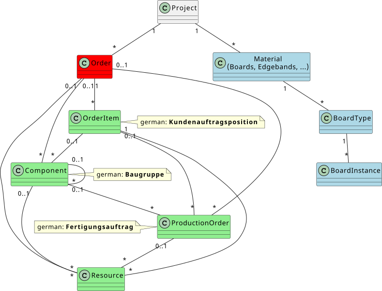

# Documentation of import/export definition for HOMAG digital products

## Version history

Version | Date       | Comment
--------|------------|---------------------------------------------------------------------------------------------
0.9     | 17.02.2020 | First Draft
1.0     | 17.07.2020 | Add 3 missing fields (ProcurementType (Dispositionsart), ProductionRoute (Fertigungsweg) and AdditionalComments. Extended supported filetypes for images
1.1     | 28.07.2020 | Add new field CncProgramName2
1.2     | 17.11.2020 | Formatting issues
1.3     | 20.11.2020 | Added ExternalId for each entity and order 
1.4     | 26.11.2020 | Comment on quantity. Always use the multiplied value over the hierarcchy
1.5     | 22.01.2021 | Extended import with intelliDivide specific fields/properties<br/>Renamed "Typ" to "Type" (both are supported in productionManager)<br/>Renamed "EdgeDiagramm" to "EdgeDiagram" (both are supported in productionManager)
1.6     | 25.01.2021 | Small clarifications and spelling corrections
1.7     | 27.01.2021 | Added support for board imports in intelliDivide<br/>(see also HOMAG API gateway)
2.0     | 28.01.2021 | Unification of intelliDivide and productionManager imports specification<br/>Added `contentVersion` attribute (current version is `2`)<br/>Added `materials` element
2.1     | 01.02.2021 | Fixed cutting sample
2.2     | 03.02.2021 | Removed BoardType and EdgeBandType
2.3     | 15.03.2021 | Added clarification for Board StockQuantity
2.4     | 19.03.2021 | Extended intelliDivide example
2.5     | 28.04.2021 | Added missing "not null" field information to PM import
2.6     | 07.06.2021 | Added "CompletionDatePlanned" property to PM import
2.7     | 21.12.2021 | Import of SecondCutLength/Width in PM and ID (CuttingLength/Width will only be used im PM for backward compatibility)
2.9     | 22.12.2021 | Added "MPR:" prefix for passing nesting parameters
2.10    | 26.01.2022 | Corrected overview diagram / clarification about date/time (RFC3339) / fixed image link example
2.11    | 26.01.2023 | Corrected nesting import example and description for mpr(x) file reference
2.12    | 01.02.2023 | RotationAngle clarification for ID nesting
2.13    | 28.02.2023 | Added 5 missing fields (Company, Project, Customer number, Notes and Person in charge)
2.14    | 06.03.2023 | Changed ExternalId to ExternalSystemId
2.15    | 17.03.2023 | Added Grain Pattern Template for parts only for cutting 
2.16    | 30.06.2023 | Grain Pattern Template for cutting documentation
2.17    | 30.06.2023 | Grain Pattern Template adjustments related to the grain set available for templates
2.18    | 19.01.2024 | Updated description of CncProgramName1 and CncProgramName2
2.19    | 10.14.2024 | Added StartDatePlanned and CompletionDatePlanned.

## Overview

The import for productionManager AND intelliDivide requires a zip compressed file containing a defined structure.
This structure is described below.

## Definition of zip file

The name of the zip file does not matter. The root folder must contain the "project.xml" file. The contents of the zip file must look like:

```text
+-- project.xml            // This is a fixed filename and must always be "project.xml"
+---\Images                // this can be any folder name
    +--- order.jpg         // this can be any file, which are referenced in the "project.xml"
    +--- part1.mpr         // this can be any file, which are referenced in the "project.xml"
    +--- part1_front.jpg   // this can be any file, which are referenced in the "project.xml"
    +--- part2_3d.png      // this can be any file, which are referenced in the "project.xml"
```

## project.xml structure

The project.xml file has a generic structure. The root node is "project". This then can contains a "orders" node, which can have multiple "order" elements. Also it can contains `materials` which can have multiple kind of `material` (like boards, edges, ...).

For productionManager the "order" is then the main element to import.

For intelliDivide the "project" is the main element (one optimization job might contain parts from multiple orders). It also might contain boards for optimization.

Please always add the `contentVersion` attribute to the project element.

Not all properties are used in all scenarios (like productionManager or intelliDivide). But you can always pass all parameters; if the parameter is not used, it will be ignored. In the below specifications, there is always a scope for each parameter, so you can see, which parameter is used in which scope. The scopes are:

* productionManager: PM

* intelliDivide: ID

Here is a example of the generic structure.

### Generic project.xml example

```xml
<?xml version="1.0"?>
<project contentVersion="2">
  <properties>
    <param name="key" value="value" />
    <!-- ... -->
  </properties>
  <orders>
    <order>
      <properties>
        <param name="key" value="value" />
        <!-- ... -->
      </properties>
      <images>
        <image>
          <properties>
            <param name="key" value="value" />
            <!-- ... -->
          </properties>
        </image>
      </images>
      <entities>
        <entity>
          <properties>
            <param name="typ" value="OrderItem" />
            <param name="key" value="value" />
            <!-- ... -->
          </properties>
          <images>
            <image>
              <properties>
                <param name="key" value="value" />
                <!-- ... -->
              </properties>
            </image>
          </images>
          <entities>
            <!-- If typ=OrderItem => all subtypes must be Component or ProductionOrder or Ressources -->
            <!-- If typ=Component => all subtypes must be Component or ProductionOrder or Ressources -->
            <!-- If typ=ProductionOrder => all subtypes must be Ressources -->
            <!-- If typ=Ressources => no sub entities are allowed -->
            <entity>
              <!-- ... -->
            </entity>
          </entities>
        </entity>
      </entities>
    </order>
  </orders>
  <materials>
    <material>
      <properties>
        <param name="key" value="value" />
        <!-- ... -->
      </properties>
      <images>
        <image>
          <properties>
            <param name="key" value="value" />
            <!-- ... -->
          </properties>
        </image>
      </images>
      <entities>
        <entity>
          <properties>
            <param name="typ" value="Board" />
            <param name="key" value="value" />
            <!-- ... -->
          </properties>
          <images>
            <image>
              <properties>
                <param name="key" value="value" />
                <!-- ... -->
              </properties>
            </image>
          </images>
          <entities>
            <!-- types can have instances or sub types -->
            <entity>
              <!-- ... -->
            </entity>
          </entities>
        </entity>
      </entities>
    </material>  
  </materials>
</project>
```

### Definition of a project

#### Logical Overview

Here you see an overview of the possible elements which can be used as an entity.
The green entities are the different types of "entities" which can be places below the order and below other entities.




All components elements can have properties and images (which also includes all kind of other files and binary files) assigned to it.

#### Valid parameters of a "project"

In the case of intelliDivide, the project corresponds to an optimization job. 
ONE project/import is used for ONE optimization order. 
Later version: We might create two intelliDivide jobs out of this, if we have different kind of production orders (cutting/nesting). 
In case of the productionManger only the parameter 'UnitofLength' is valid.

Name         | Type   | Description       | Scope
-------------|--------|-------------------|-------
Type         | enum   | Cutting / Nesting | ID
Name         | string | Name of the job   | ID
Machine      | string | The id of the machine which will be used for optimization. If this machine is not found, intelliDivide will use a default machine and assume a cutting job. | ID
Parameter    | string | Parameter name for optimization. If this parameter set is not found, intelliDivide will use a default | ID
UnitOfLength | enum   | mm or inch        | ID/PM

#### Valid parameters of an "order"

The parameters of the order contains the following information:

 | |ID |Type|Constraints|Description
|------------------|--------------------|--------------------|-------------------------------------------------|-------
**Order header (14)**|
| |OrderName        |Text| (100; not null)| The name of the order
| |OrderNumber      |Text| (100; not null)     | The number assigned to this order
| |CustomerName     |Text|(255)               | The name of the customer                             
| |CustomerNumber         | Text|(100)               | The number assigned to that customer                 
| |Company                | Text|(100)               | The name of the company                               
| |OrderDescription       | Text|(255)               | An optional description of the order                 
| |Project                | Text|(100)               | The name of the project                              
| |PersonInCharge         | Text|(100)               | The name of the person in charge of the project      
| |OrderDate              | Date| | The creation date or the order import date
| |OrderItems             | Text| | The positions in the order
| |DeliveryDatePlanned           | Date| | The planned delivery date 
| |OrderItemDescriptions|Text| |Descriptions of order items
| |StartDatePlanned| Date| |The planned start date 
| |CompletionDatePlanned| Date| |The planned completion date
**Address (5)**|  
| |Street|Text||The name of the street 
| |HouseNumber|Text||The house number 
| |City| Text||The name of the city      
| |PostalCode|Text| |The postal code
| |Country|Text| |The country for the address
**Production (1)**|
| |Lots|Text||A lot is created from multiple orders
**Production (7)**|
| |OrderStatus|Whole number||The status of the order
| |ChangedAt|Date and time|| The date and time of the last change
| |StartedAt| Date| |The start date 
| |CompletedAt|Date|| The completion date
| |QuantityOfArticles|Whole number| |The numebr of articles
| |QuantityOfParts|Whole number| | The number of parts 
| |QuantityOfPartsPlanned| Whole number| |The planned number of parts
**Additional data (1)**|
| |Notes|Text||Notes/Comments |

##### Sample order

```xml
<project contentVersion="2">
  <orders>
    <order>
      <properties>
        <param name="OrderName" value="Smith bathroom" />
        <param name="OrderNumber" value="10745" />
        <param name="CustomerName" value="Smith, Simon" />
        <param name="CustomerNumber" value="000957" />
        <param name="OrderDate" value="2020-02-16T19:01:03.9866667Z"/>
        <param name="DeliveryDate" value="2020-02-25T19:01:03.9866667Z" />
        <param name="AddressField1" value="Franz Maier" />
        <param name="AddressField2" value="Kurzer Weg 1" />
        <param name="AddressField3" value="12245 Hausen" />
        <param name="AddressField4" value="Germany" />
        <param name="StartDatePlanned" value="2020-02-16T19:01:03.9866667Z" />
        <param name="CompletionDatePlanned" value="2020-02-22T19:01:03.9866667Z" />
      </properties>
      <images>
        <image>...</image>
        <image>...</image>
      </images>
      <entities>
        <entity>...</entity>
        <entity>...</entity>
      </entities>
    </order>
  </orders>
</project>
```

### Definition of an order entity

#### Valid parameters of an order entity

The entities contains the following information.
Entities can be nested, so that we can construct a hierarchy of entities.

The scope defines if this parameter is used for productionManager (PM) and/or intelliDivide (ID).

##### Order entity parameter "Type"

Type                   | Description | Scope
-----------------------|------------------------------------------------------------------|-------
`OrderItem`            | The final article, that will be sent to the customer. Can exist only on the first/highest level of the hierarchy.<br/>If this is above a ProductionOrder, then the name of the ArticleDescription will be used as the OrderPosition in intelliDivide         | PM/ID
`Component`            | For structuring the order. allows a hierarchical view over all entities. Can exist on every level of the hierarchy below the OrderItem and above the productionOrder|PM/ID
`ProductionOrder`      | Defines a part, that must be produced.                           | PM/ID
`ProductionEntityItem` | Prepared for further functionality. Actually not (yet) supported | PM
`Resource`             | Resources                                                        | PM

##### All order entity parameters

The param's of the level order entity can contain the following information:

Column                    | Type                     | Description | Scope
--------------------------|--------------------------|-------------|-------
Type                      | string (not null)        | The type of the ProductionEntity; required; valid entries see above|PM/ID
Barcode                   | nvarchar(100)            | Barcode of a part. If empty, a generated unique number will be used|PM
OrderItemNumber           | nvarchar(100)            | The number of the orderPosition from the importSystem. Only filled on the ProductionEntity of Type OrderItem|PM
ArticleNumber             | nvarchar(100) (not null) | Item or partCode |PM/ID
ArticleDescription        | nvarchar(255)            | Description|PM/ID
ArticleGroup              | nvarchar(100)            | Classification for the article(bottom, top, front..)|PM
StartDatePlanned          | DateTimeOffset(7)        | Default creation date ([RFC3339](https://datatracker.ietf.org/doc/html/rfc3339))|PM
CompletionDatePlanned     | DateTimeOffset(7)        | The planned completion date ([RFC3339](https://datatracker.ietf.org/doc/html/rfc3339))|PM
Quantity                  | decimal(15,5; not null)  | The "real" quantity. Please multiply the quantities over the complete hierarchy to get the quantity of a part|PM/ID
QuantityUnit              | nvarchar(50; not null)   | Quantity unit; default "pcs"|PM
MaximumQuantity           | decimal(15,5)            | Maximum quantity|PM/ID
Hinge                     | nvarchar(100)            |            |PM
Length                    | decimal(15,5)            | unit / mm  |PM/ID
Width                     | decimal(15,5)            | unit / mm  |PM/ID
Thickness                 | decimal(15,5)            | unit / mm  |PM
Grain                     | string/<br/>integer      | NoGrain (0)<br/>Lengthwise (1)<br/>Crosswise (2)|PM/ID
Material                  | nvarchar(255)            |            |PM/ID
SecondCutLength           | decimal                  | unit / mm<br/>Second cutting length  (e.g. part returns to saw from laminating)|PM/ID
SecondCutWidth            | decimal                  | unit / mm<br/>Second cutting width (e.g. part returns to saw from laminating)|PM/ID
FinishLength              | decimal                  | unit / mm  |PM/ID
FinishWidth               | decimal                  | unit / mm  |PM/ID
ProcurementType           | nvarchar(100)            |            |PM
ProductionRoute           | nvarchar(255)            |            |PM/ID
EdgeDiagram               | string                   | e.g. 001:110:000:000<br/>(for more information see [Edge diagram](https://docs.homag.cloud/en/intellidivide/in-a-nutshell/edge-diagram) |PM/ID
EdgeFront                 | string                   | Material of the front|PM/ID
EdgeRight                 | string                   | Material of the right|PM/ID
EdgeBack                  | string                   | Material of the back|PM/ID
EdgeLeft                  | string                   | Material of the left|PM/ID
AdditionalComments        | nvarchar(300)            |            |PM/ID
FrontLaminate             |                          |            |PM/ID
BackLaminate              |                          |            |PM/ID
CncProgramName            |                          | ID: If this is set for a nesting job, then we try to use this as the mpr for optimization. Please use the same filename as you provide in the `ImageLinkBinary` attribute of the attached mpr file (including the file path). This file is then searched in the zip file.|ID
CncProgramName1           | string                   | Only CNC program name or path incl. subfolder.<br/>Recommendation: article or project name\name.mpr<br/>Example: article1\side_1.mpr |PM/ID
CncProgramName2           | string                   | Only CNC program name or path incl. subfolder.<br/>Recommendation: article or project name\name.mpr<br/>Example: article1\side_1.mpr |PM/ID
ExternalSystemId          | nvarchar(100)            | An optional external id, which will be used in an re-import to detect the "old import" and update the existing data|PM/ID
PartFamily                |                          |            |ID
LabelLayoutName           | string                   | Layout name for CADmatic label generation|ID
LabelDemand               | integer                  | If `1` then a label should be printed|ID
RotationAngle             | double/string            | Rotation angle of the part (only for nesting)<br/>If you want to use the default angle from the optimization parameter set, you must not pass this parameter.<br/>If you want to set this to "Free", then you must set this value to "Free" instead of an angle.|ID
ADDINFO:&lt;any-text&gt;  | string                   | User defined fields. Any user defined field|ID
MPR:&lt;variable-name&gt; | string                   | Any mpr variable name with its value; numbers must use "." as comma separator |ID
GrainPattern              | string                   | Grain pattern template and positions for cutting jobs<br/>(link to documentation will follow)|PM/ID

##### Sample 1

```xml
<project contentVersion="2">
  <orders>
    <order>
      <properties>...</properties>
      <images>
        <image>...</image>
        <image>...</image>
      </images>
      <entities>
        <entity>
          <properties>
            <param name="Typ" value="OrderItem"/>
            <param name="Barcode" value="10248700"/>
            <param name="OrderItemNumber" value="003"/>
            <param name="ArticleNumber" value="49174" />
            <param name="ArticleDescription" value="Stone_Bench"/>
            <param name="ArticleGroup" value="Purchase part"/>
            <param name="StartDatePlanned" value="2020-02-17T19:01:04.0033333Z"/>
            <param name="Quantity" value="1.00000"/>
            <param name="QuantityUnit" value="pcs"/>
            <param name="Length" value="630.00000"/>
            <param name="Width" value="1470.00000"/>
            <param name="Thickness" value="360.00000"/>
            <param name="Grain" value="NoGrain"/>
          </properties>
          <images>
            <image>...</image>
            <image>...</image>
          </images>
          <entities>
            <entity>...</entity>
            <entity>...</entity>
          </entities>
        </entity>
      </entities>
    </order>
  </orders>
</project>
```

### Definition of an image (files)

#### valid parameters of an image

Represents one image or binary info for an element.

The parameters or the level entity can contain the following information:

Column           | Type   | Comment
-----------------|--------|-----------
Category         | string |**Valid entries**:<br>Unknown<br/>MaterialSurfaceImage<br/>Autodesk3DsModel<br/>RenderedImage<br/>FrontImage<br/>LeftImage<br/>RightImage<br/>AboveImage<br/>AssemblyXRayImage<br/>AssemblyImage<br/>OverviewImage<br/>PartEdgeImage<br/>MPR<br/>ReportLabel<br/>Ignore<br/><br/>If category is set to `Ignore` then this entry will be ignored.<br/>If the category is not in tis list, then we use the category `Unknown`.
Description      | string |
OriginalFileName | string |
ImageLinkBinary  | string |Relative link inside the Zip file to the binary (use for all other categories, expect images)
ImageLinkPicture | string |Relative link inside the Zip file to the image (we only support png, jpg, jpeg, bmp, gif; all other file extensions will be ignored here)

#### Sample 2

```xml
<project contentVersion="2">
  <orders>
    <order>
      <properties>...</properties>
      <images>
        <image>...</image>
        <image>...</image>
      </images>
      <entities>
        <entity>
          <properties>...</properties>
          <images>
            <image>...</image>
            <image>
              <properties>
                <param name="Category" value="FrontImage"/>
                <param name="Description" value="ART_FRONT"/>
                <param name="OriginalFileName" value="49153.PNG"/>
                <param name="ImageLinkPicture" value="Images\49153.PNG"/>
              </properties>
            </image>
            <image>
              <properties>
                <param name="Category" value="RenderedImage"/>
                <param name="Description" value="ART_RENDER"/>
                <param name="OriginalFileName" value="49153.PNG"/>
                <param name="ImageLinkPicture" value="Images\49153.PNG"/>
              </properties>
            </image>
            <image>...</image>
            <image>...</image>
          <images>
        </entity>
      </entities>
    </order>
  </orders>
</project>
```

#### Valid parameters of an "material"

The parameters of the material contains the following information:

Name | Type   | Description                                                                                                 | Scope
-----|--------|-------------------------------------------------------------------------------------------------------------|-------
Type | string | The type of the material group.<br>Currently we only support `Boards`<br/>Later we also support "Edgebands" | ID

##### Sample material

```xml
<project contentVersion="2">
  <materials>
    <material>
      <properties>
        <param name="Type" value="Boards" />
      </properties>
      <entities>
        <entity>...</entity>
        <entity>...</entity>
      </entities>
    </material>
  </materials>
</project>
```

### Definition of an material entity for `boards`

#### Valid parameters of a material entity for `boards`

The entities contains the following information.
Entities can be nested, so that we can construct a hierarchy of entities.

##### Material entity parameter "Type"

Type           | Description                                                                                                   | Scope
---------------|---------------------------------------------------------------------------------------------------------------|----------------
`BoardType`    | Describes a specific board with dimensions and optional quantity<br/>It can contain `BoardInstance` entities. | ID
`BoardInstance`| Describes an instance of an board or a stack with a given name                                                | (not yet used!)

##### All material entity parameters

The param's of the level material entity can contain the following information:

Column    | Type                | Description                                                   | Valid in Type | Scope
----------|---------------------|---------------------------------------------------------------|---------------|------
Type      | string              | Valid entries see above                                       | (all)         | ID
Material  | string              |Material code                                                  | `BoardType`   | ID
Code      | string              |Board code (german: Plattencode)                               | `BoardType`   | ID
Length    | double              |                                                               | `BoardType`   | ID
Width     | double              |                                                               | `BoardType`   | ID
Thickness | double              |                                                               | `BoardType`   | ID
Quantity  | integer             |Stock quantity / you can leave it empty, then 999 will be used | `BoardType`   | ID
Grain     | string/<br/>integer | NoGrain (0)<br/>Lengthwise (1)<br/>Crosswise (2)              | `BoardType`   | ID
BoardType | enum/<br/>integer   |StockBoard (0; default)<br/>Offcut (1)<br/>AutomaticOffcut (2) | `BoardType`   | ID

All entities can have images or files attached.

##### Material board sample 1

```xml
<project contentVersion="2">
  <materials>
    <material>
      <properties>
        <param name="Type" value="Boards" />
      </properties>
      <entities>
        <entity>
          <properties>
            <param name="Type" value="BoardType" />
            <param name="Material" value="MFC18-OAK" />
            <param name="Thickness" value="18" />
            <param name="Code" value="MFC18-OAK-01" />
            <param name="Length" value="3050.0" />
            <param name="Width" value="1220" />
            <param name="Quantity" value="426" />
            <param name="Grain" value="Lengthwise" />
          </properties>
        </entity>
        <entity>
          <properties>
            <param name="Type" value="BoardType" />
            <param name="Material" value="MFC12-RED" />
            <param name="Thickness" value="12" />
            <param name="Code" value="MFC12-RED-01" />
            <param name="Length" value="3050.0" />
            <param name="Width" value="1220" />
            <param name="Quantity" value="426" />
            <param name="Grain" value="Lengthwise" />
          </properties>
          <images>
            <image>
              <properties>
                <param name="Category" value="MaterialSurfaceImage"/>
                <param name="Description" value="Surface red"/>
                <param name="OriginalFileName" value="red.png"/>
                <param name="ImageLinkPicture" value="Images\red.png"/>
              </properties>
            </image>
          </images>
        </entity>
      </entities>
    </material>
  </materials>
</project>
```

## Example xml files

### Examples for *productionManager*

[productionManager example 1](./Samples/Data/HomagProject.zip)
[productionManager example 2](./Samples/Data/HomagProject2.zip)

### Examples for *intelliDivide*

[intelliDivide example cutting](./Samples/Data/cutting_project.zip)
[intelliDivide example nesting](./Samples/Data/nesting_project.zip)

#### Cutting job example

```xml
<?xml version="1.0" encoding="utf-8"?>
<project contentVersion="2">
  <properties>
    <param name="Name" value="TestImportCuttingJob2" />
    <param name="Machine" value="4711" />
    <param name="Parameter" />
    <param name="UnitOfLength" value="mm" />
    <param name="Type" value="Cutting" />
  </properties>
  <orders>
    <order>
      <properties>
        <param name="OrderName" value="Smith bathroom" />
        <param name="CustomerName" value="Smith, Simon" />
        <param name="OrderDate" value="2020-02-16T19:01:03.9866667Z"/>
      </properties>
      <images />
      <entities>
        <entity>
          <properties>
            <param name="Type" value="OrderItem" />
            <param name="ArticleDescription" value="Pos 01" />
          </properties>
          <entities>
            <entity>
              <properties>
                <param name="Type" value="ProductionOrder" />
                <param name="ArticleNumber" value="spabes16weiss"/>
                <param name="ArticleDescription" value="DRESSER-TOP" />
                <param name="Material" value="MFC18-OAK" />
                <param name="Length" value="1000.0" />
                <param name="Width" value="600.0" />
                <param name="Thickness" value="18" />
                <param name="Quantity" value="2" />
                <param name="MaximumQuantity" value="4" />
                <param name="Grain" value="Lengthwise" />
                <param name="FinishLength" value="762.0"/>
                <param name="FinishWidth" value="553.0"/>
                <param name="EdgeFront" value="EF"/>
                <param name="EdgeRight" value="ER"/>
                <param name="EdgeBack" value="EB"/>
                <param name="EdgeLeft" value="EL"/>
                <param name="FrontLaminate" value="FL"/>
                <param name="BackLaminate" value="BL"/>
                <param name="EdgeDiagram" value="011:011:000:000"/>
                <param name="CncProgramName1" value="CNC1"/>
                <param name="CncProgramName2" value="CNC2"/>
                <param name="ProductionRoute" value="route"/>
                <param name="PartFamily" value="familiy"/>
                <param name="LabelLayoutName" value="labelLayout"/>
                <param name="LabelDemand" value="1"/>
                <param name="GrainPattern" value="2 Parts (2 x 1):1.1:1:1"/>
              </properties>
              <images />
              <entities />
            </entity>
          </entities>
        </entity>
        <entity>
          <properties>
            <param name="Type" value="ProductionOrder" />
            <param name="ArticleDescription" value="DRESSER-BACK" />
            <param name="Material" value="MFC18-OAK" />
            <param name="Length" value="964.0" />
            <param name="Width" value="1082.0" />
            <param name="Thickness" value="18" />
            <param name="Quantity" value="2" />
            <param name="MaximumQuantity" value="2" />
            <param name="Grain" value="Lengthwise" />
          </properties>
          <images />
          <entities />
        </entity>
      </entities>
    </order>
  </orders>
  <materials>
    <material>
      <properties>
        <param name="Type" value="Boards" />
      </properties>
      <entities>
        <entity>
          <properties>
            <param name="Type" value="BoardType" />
            <param name="Material" value="MFC18-OAK" />
            <param name="Thickness" value="18" />
            <param name="Material" value="MFC18-OAK" />
            <param name="Code" value="MFC18-OAK-01" />
            <param name="Length" value="3050.0" />
            <param name="Width" value="1220" />
            <param name="Quantity" value="426" />
            <param name="Grain" value="Lengthwise" />
          </properties>
        </entity>
      </entities>
    </material>
  </materials>
</project>
```

#### Nesting job example

```xml
<?xml version="1.0" encoding="utf-8"?>
<project contentVersion="2">
  <properties>
    <param name="Name" value="Test job" />
    <param name="Machine" value="e3c196fb-b1ec-4038-b88b-4434fd578b18" />
    <param name="Parameter" />
    <param name="UnitOfLength" value="mm" />
    <param name="Type" value="Nesting" />
  </properties>
  <orders>
    <order>
      <properties>
        <param name="OrderName" value="MaterialAssistEdge19_2020" />
        <param name="CustomerName" value="Homag" />
        <param name="OrderDate" value="2020-02-16T19:01:03.9866667Z"/>
		<param name="Quantity" value="1" />
      </properties>
      <images />
      <entities>
        <entity>
          <properties>
            <param name="Type" value="OrderItem" />
            <param name="ArticleDescription" value="DRESSER-TOP" />
            <param name="OrderItemNumber" value="1" />
			<param name="ArticleNumber" value="4711" />
			<param name="Quantity" value="1"/>
          </properties>
          <entities>
            <entity>
              <properties>
                <param name="Type" value="ProductionOrder" />
                <param name="ArticleDescription" value="MaterialAssistEdge" />
                <param name="Material" value="iX_MDF05_Raw" />
                <param name="Length" value="810.0" />
                <param name="Width" value="485.0" />
                <param name="Thickness" value="5.0" />
                <param name="Quantity" value="1" />
                <param name="MaximumQuantity" value="1" />
                <param name="Grain" value="NoGrain" />
                <param name="EdgeFront" value="" />
                <param name="EdgeBack" value="" />
                <param name="EdgeRight" value="" />
                <param name="EdgeLeft" value="" />
                <param name="EdgeDiagram" value=":::" />
                <param name="FinishLength" />
                <param name="FinishWidth" />
                <!-- This file (CncProgramName) will be used for the nesting job -->
                <param name="CncProgramName" value="mprs/Pentagon.mpr" />
                <param name="CncProgramName1" value="Material1015" />
                <param name="CncProgramName2" value="" />
                <param name="ArticleNumber" value="001_49153" />
                <param name="ProductionRoute" value="1_SAEQ_X|2_CEEQ_P|" />
                <param name="LabelLayoutName" value="" />
                <param name="MPR:l" value="120.4" />
              </properties>
              <images>
				<image>
					<properties>
					  <param name="Category" value="MPR"/>
					  <param name="Description" value="Pentagon"/>
					  <param name="OriginalFileName" value="Pentagon.mpr"/>
					  <param name="ImageLinkBinary" value="mprs/Pentagon.mpr"/>
					</properties>
				</image>
              </images>
              <entities />
            </entity>
          </entities>
        </entity>
      </entities>
    </order>
  </orders>
  <materials>
     <!-- ... -->
  </materials>
</project>
```

##### Parameter "GrainPattern"

  GrainPattern                | Description 
------------------------------|-----------------------------------------------------------------------------------------------------------------------------------------------------
                              | The grain match template has 12 default templates and their names are localized with the language set into Tapio account for a particular subscription
                              | English names are: "2 Parts (2 x 1)", "2 Parts (1 x 2)", "2+1 part, longitudinal right (2 x 2)", "1+2 part, longitudinal left (2 x 2)", "2+1 part, crosswise bottom (2 x 2)",
                              | "1+2 part, crosswise top (2 x 2)", "3 Parts (3 x 1)", "3 Parts (1 x 3)", "4 Parts (2 x 3)", "4 Parts (2 x 2)", "4 Parts (1 x 4)", "4 Parts (4 x 1)".
                              | German names are: "2 Teile (2 x 1)", "2 Teile (1 x 2)", "2+1 Teil längs rechts (2 x 2)", "+2 Teil längs links (2 x 2)", "2+1 Teil quer unten (2 x 2)", "1+2 Teil quer oben (2 x 2)",
                              | "3 Teile (3 x 1)", "3 Teile (1 x 3)", "4 Teile (2 x 3)", "4 Teile (2 x 2)", "4 Teile (1 x 4)", "4 Teile (4 x 1)"
                              |
  `value=`                    | name delimiter is ":" and into (a x b) a is the number of columns and b is the number of rows
                              | into the example: value="2 Parts (2 x 1):1.1:1:0" => "2 Parts (2 x 1)" is the name of the grain match template, 2 columns and 1 row
                              |                                                 => "1.1" is the position into the template
                              |                                                 => "1" is instance of the template
							  |                                                 => "0" is the template grain ( 0 = None; 1 = Lengthwise grain; 2 = Cross grain => similar as for the parts;) all the positions into a template instance
							  |                                                       need to have the same grain
                              | 
                              | value can get also multiple positions for the template in case the parameter Quantity has a value bigger that 1 exp: value="2 Parts (2 x 1):1.1 2.1:1"
                              |
  `2 Parts (2 x 1)`           | available positions => 1.1 2.1 
                              |
  `2 Parts (1 x 2)`           |  available positions => 1.1 1.2
                              |  
  `2+1 part, longitudinal right (2 x 2)` |  available positions => 1.1 1.2 2.1
                              |  
  `1+2 part, longitudinal left (2 x 2)` |  available positions => 1.1 2.1 2.2
                              | 
  `2+1 part, crosswise bottom (2 x 2)` |  available positions => 1.1 1.2 2.1
                              | 
 `1+2 part, crosswise top (2 x 2)` |  available positions => 1.1 1.2 2.2
                              | 
 `3 Parts (3 x 1)`            |  available positions => 1.1 2.1 3.1
                              |
 `3 Parts (1 x 3)`            |  available positions => 1.1 1.2 1.3
                              |
 `4 Parts (2 x 3)`            |  available positions => 1.1 1.2 1.3 2.1
                              |
 `4 Parts (2 x 2)`            |  available positions => 1.1 1.2 2.1 2.2
                              |
 `4 Parts (1 x 4)`            |  available positions => 1.1 1.2 1.3 1.4
                              |
 `4 Parts (4 x 1)`            |  available positions => 1.1 2.1 3.1 4.1
  
                              
  
