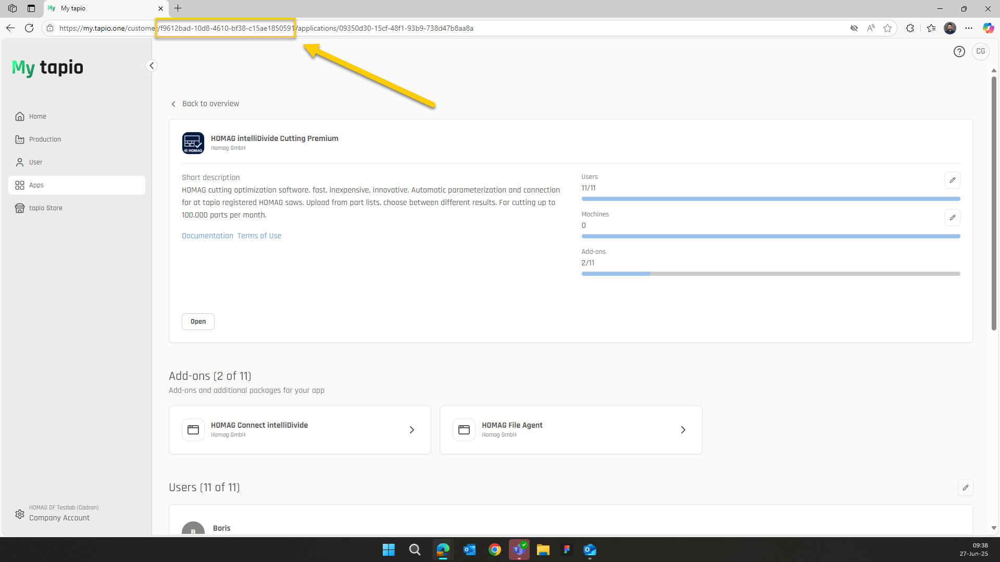
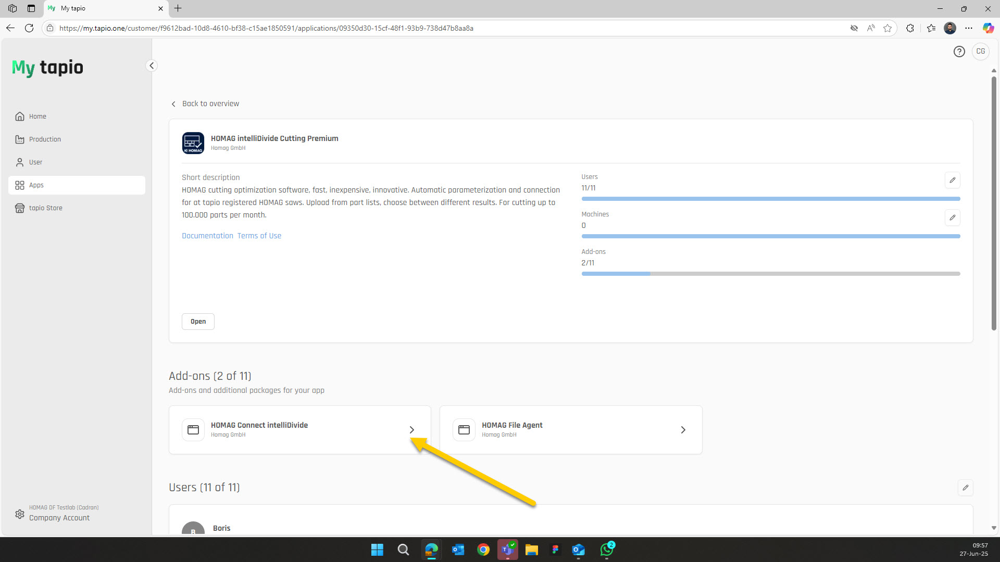
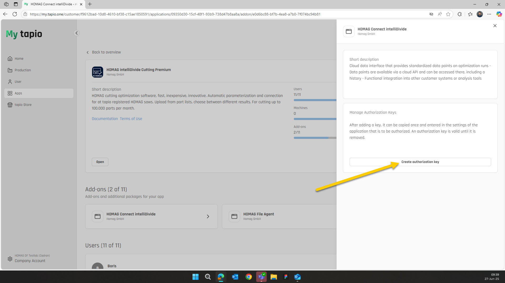
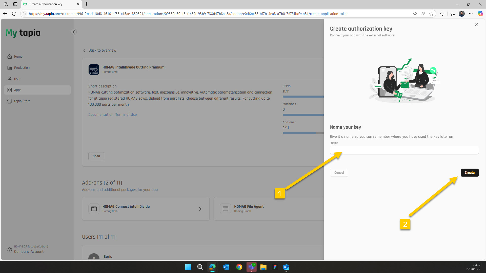
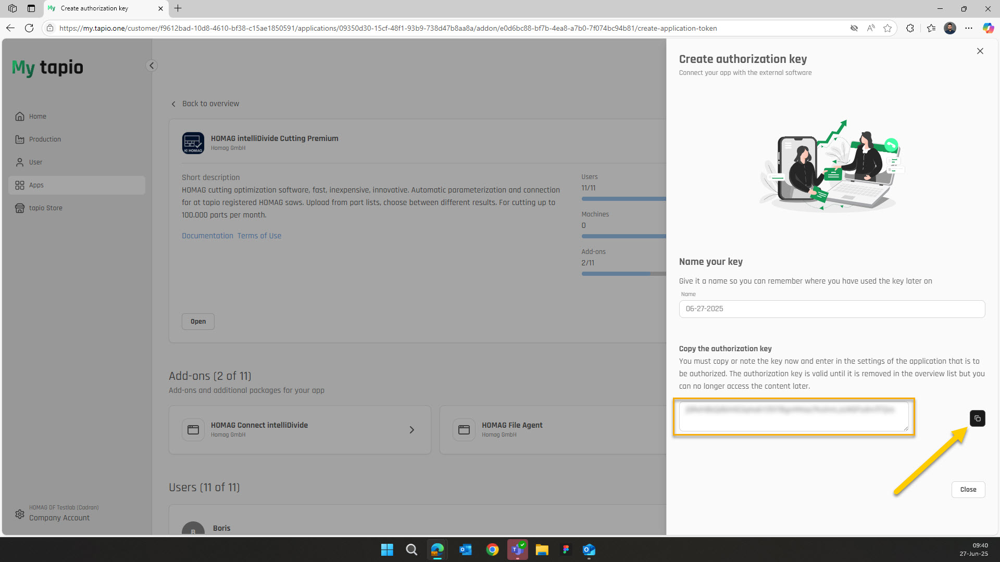

# Authentication / Authorization

In order to access a HOMAG application via the respective HOMAG Connect REST API, you must have a licence for the relevant application and the necessary authentication details, which include the Subscription Id (username) and an Authorization Key (password).

The license can be purchased as an Add-on to the application in the tapio Marketplace.

The Subscription Id and Authorization Key can be obtained by subscription administrators following these steps:

- Log in to your Tapio account at https://my.tapio.one.

- Copy the Subscription Id from the browser bar.

- Navigate to the respective application in the applications section.

- Navigate to the HOMAG Connect details in the Add-ons section.

- Click on "Create authorization key" 

- Name your key(1). Enter a meaningful description for your authorization key so that you can easily identify the correct key later if you wish to revoke it.
- And then create the key(2) . 

- Copy the generated Authorization Key

<strong>Note:</strong> Make sure to keep your access token confidential as it provides authorized access to the apps.
