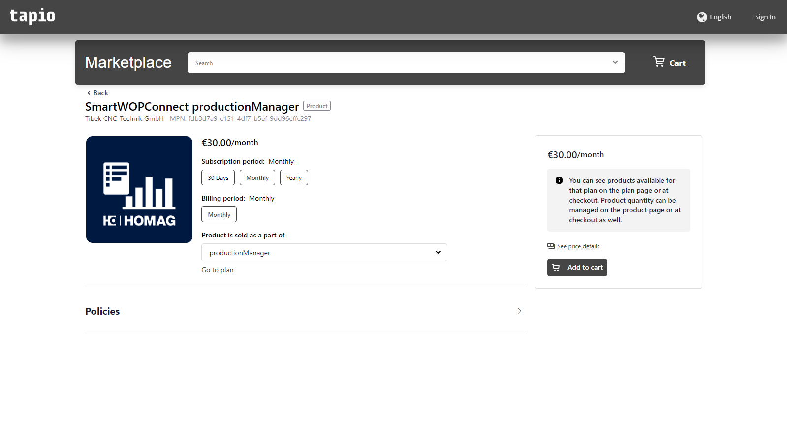
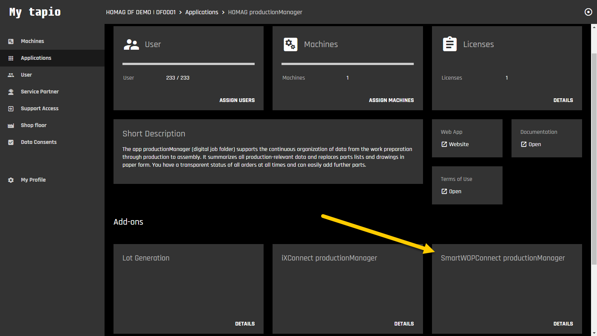
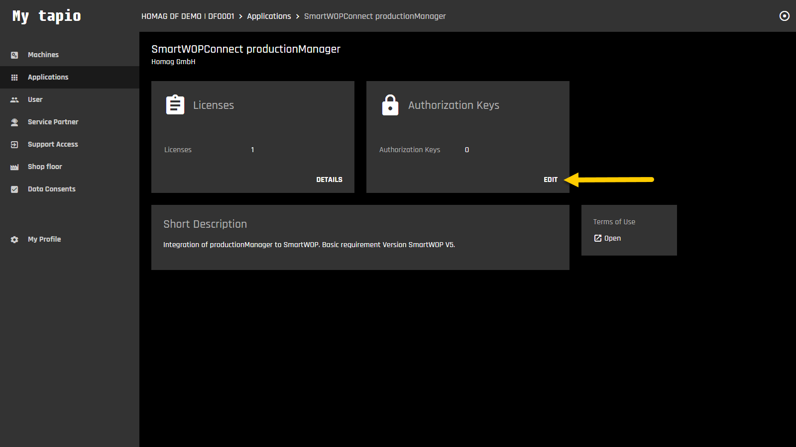
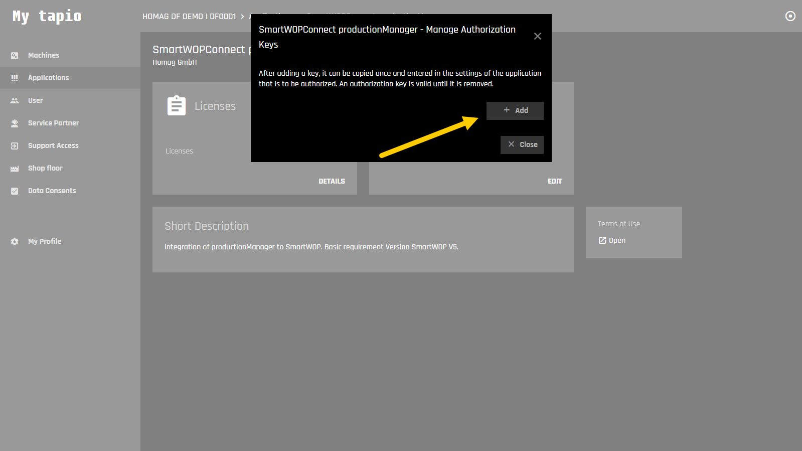
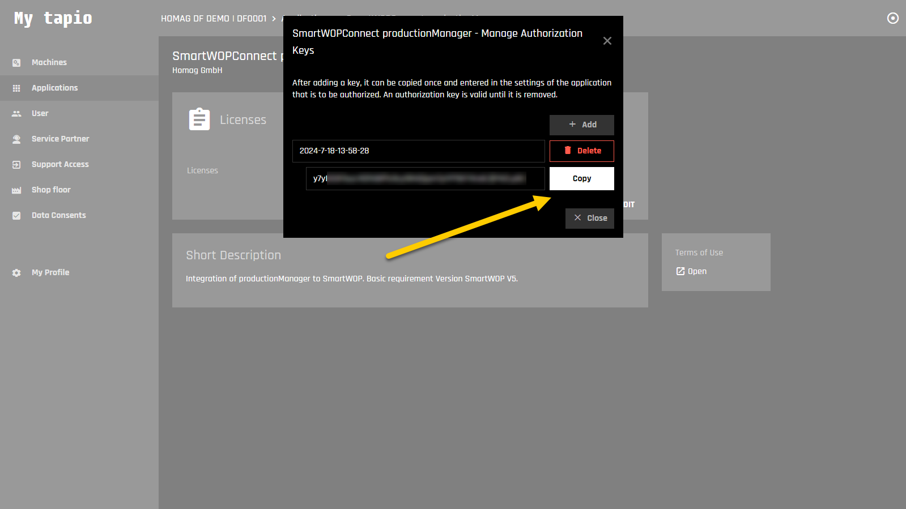
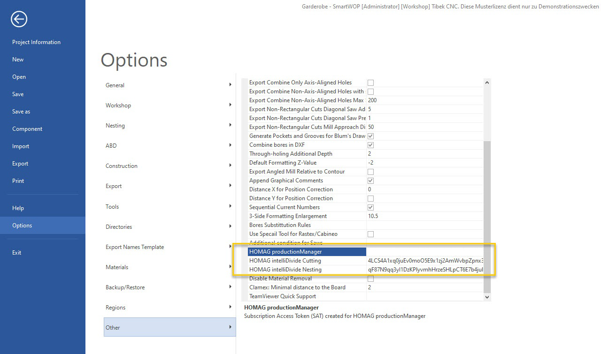
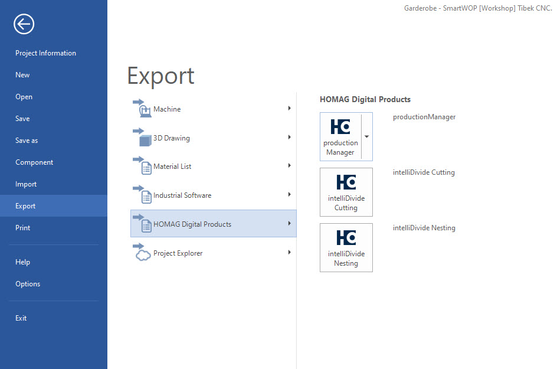

# Authentication / Authorization for tapio partners

_HOMAG Connect APIs_ provide customers with the ability to seamlessly integrate HOMAG applications into their existing business processes and systems through programmatic access. To utilize the API, the HOMAG Connect add-on must be licensed for the corresponding application. Authentication is achieved using the _subscription Id_ and an _authorization key_.

```c#
// Create new instance of the productionManager client:

var subscriptionId = // Customer subscriptionId
var authorizationKey = // Authorization key generated by the customer in SmartWOPConnect add-on
            
var client = new ProductionManagerClient(subscriptionId, authorizationKey);
```

For more information on authentication and authorization for customers, please refer to the details provided in the [HOMAG Connect](../../../Applications/IntelliDivide/Samples/Authentication) documentation.

The HOMAG Connect APIs provide [tapio partners](https://docs.homag.cloud/en/data-exchange/in-a-nutshell/partner) with the ability to seamlessly integrate and streamline processes for their customers by accessing HOMAG apps. Additionally, tapio partners can develop and offer their own add-ons to HOMAG applications on the platform. To authenticate and access the HOMAG Connect API, partners use a _partner Id_ provided by HOMAG and an authorization key, which can be created by the customer within the partner add-on.

```c#
// Create new instance of the productionManager client:

var partnerId = // Partner Id provided by HOMAG
var authorizationKey = // Authorization key generated by the customer in HOMAG Connect add-on
            
var client = new ProductionManagerClient(partnerId, authorizationKey);
``` 

During authentication, the system verifies if the customer has licensed the relevant add-on for the specific application and partner Id, and grants or denies access based on this information. This ensures that only authorized users can access the integrated processes.

## Example: Partner add-on SmartWOPConnect

SmartWOP allows customers to transfer orders directly to productionManager. This eliminates the intermediate step of manually exporting and importing orders. This makes the process much smoother and less error prone.

To use this feature, the customer must license the SmartWOPConnect productionManager add-on at [tapio Marketplace](https://customerportal.tapio.one/marketplace/ccp/v/pa/marketplace/home-view?vendorId=1022097719).



This add-on is then available at [my.tapio.one](https://my.tapio.one) in the HOMAG productionManager application.



In the authorization keys dialog, the customer can generate a new authorization key.







The generated Authorization Key is [inserted into smartWOP](https://docs.homag.cloud/en/smartwop/in-a-nutshell/enter-interface-license). 



It is then used to authenticate the partner add-on in the HOMAG Connect productionManager API when [exporting a project](https://docs.homag.cloud/en/smartwop/in-a-nutshell/interface-to-apps).



```c#
// Create new instance of the productionManager client

var partnerId = // SmartWOP partner Id
var authorizationKey = // Authorization key generated by the customer in SmartWOPConnect add-on
            
var productionManagerClient = new ProductionManagerClient(partnerId, authorizationKey);

// Send project from smartWOP to productionManager

var projectFile = new FileInfo(@"Project.zip");
            
var request = new ImportOrderRequest
{
    Action = ImportOrderRequestAction.ImportOnly
};

var response = await productionManagerClient.ImportOrderAsync(request, projectFile);

``` 

If you are interested in becoming a [tapio partner](https://docs.homag.cloud/en/data-exchange/in-a-nutshell/partner) and developing your own add-ons, please contact us at [digitalfactory@homag.com](mailto:digitalfactory@homag.com).
