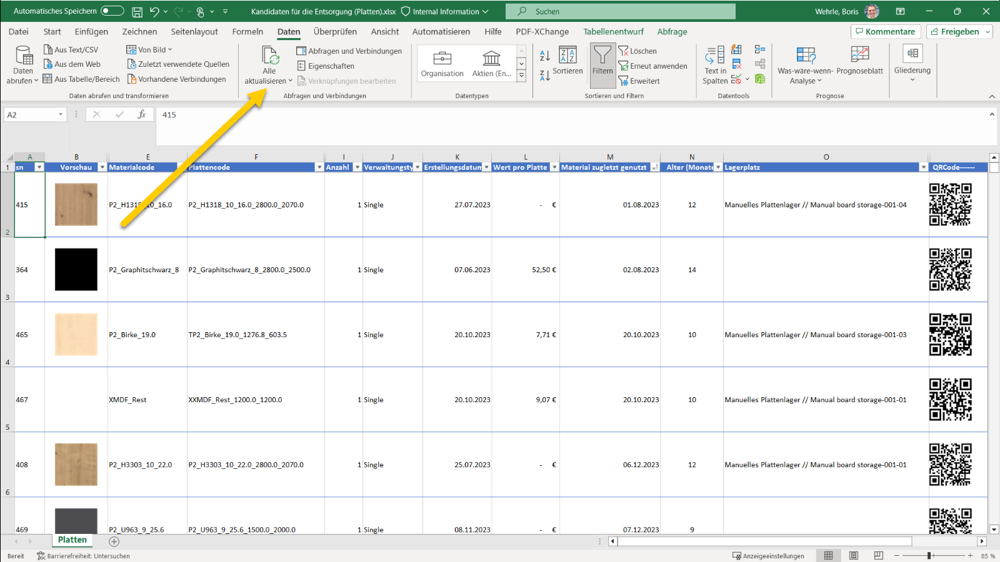

# Analyze data with Excel

The data retrieved from the APIs can be used to create comprehensive reports within Excel.  

## How to use work with Excel templates

We have created a variety of templates that serve as the basis for creating personalized reports. 

These templates are available in the Samples section of each client's documentation.

Here are the steps for using the templates:

1. Download the template you want to use.

2. Open the template in Excel and activate editing.

3. In the ribbon section data click on <strong>Refresh all</strong> to retrieve the data from the API.

4. Enter Subscription Id (1) and Authentication Key (2). Please check the [Authorization page](../../../Authentication/Readme.md) for more information about how to get them.

The excel file is now connected to your subscription and ready to use. 

The authentication informationen is stored in the Excel file. When you open the file again, you can refresh the data without entering the authentication information again.

